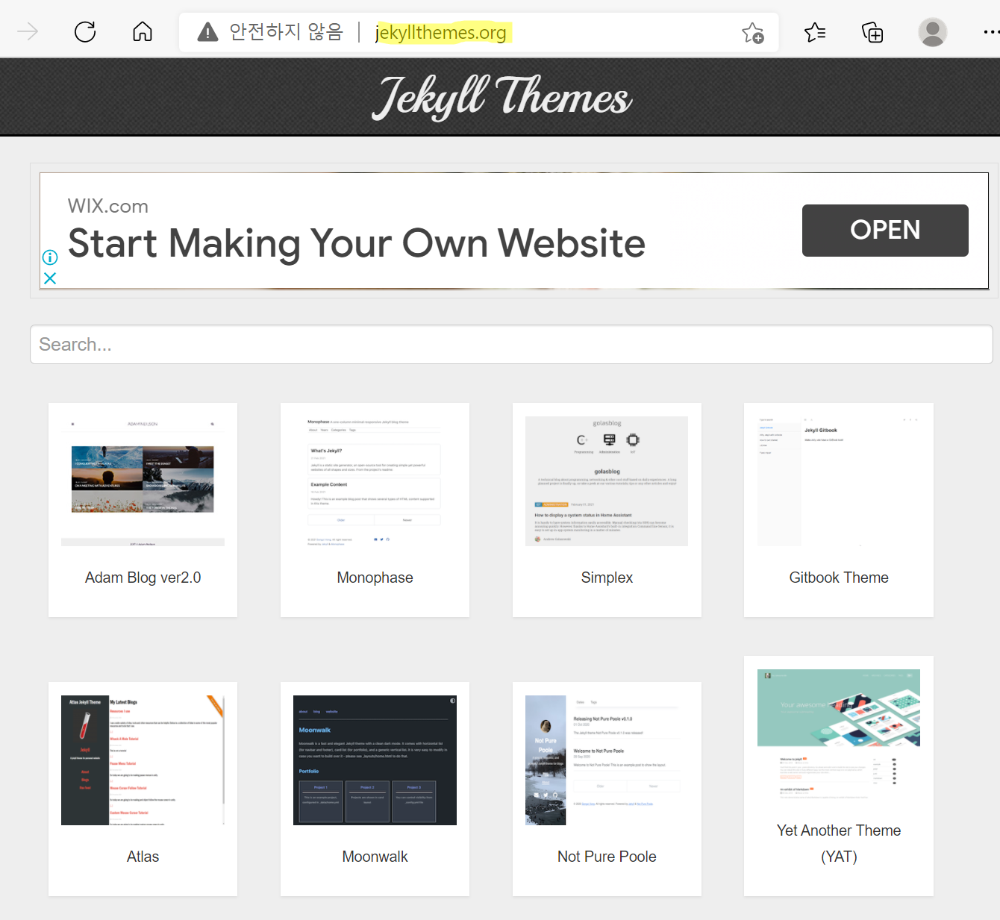
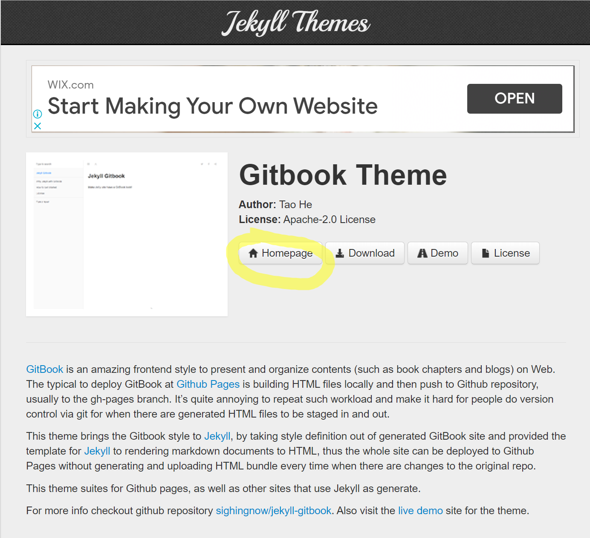
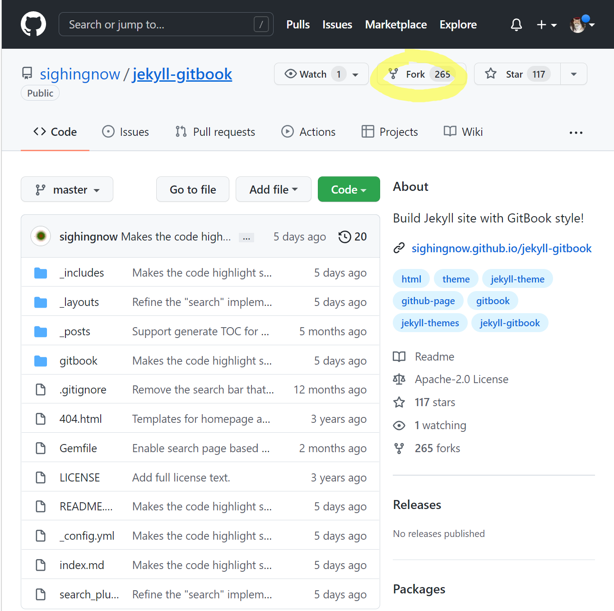
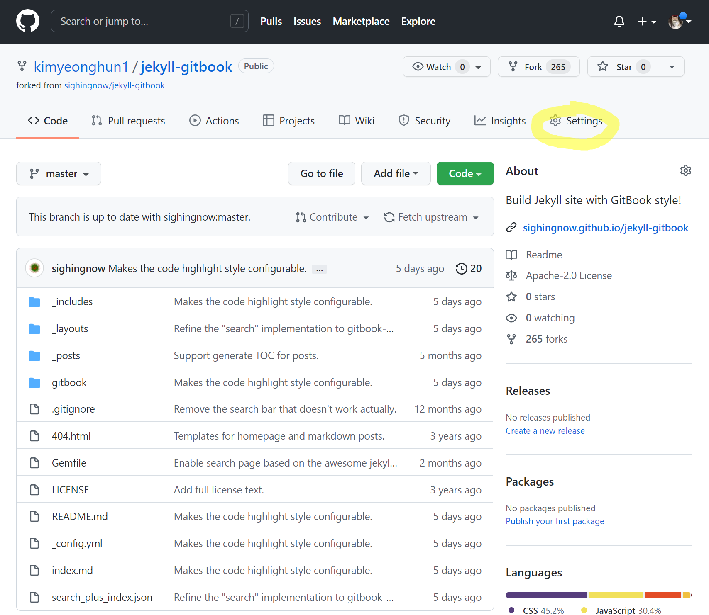
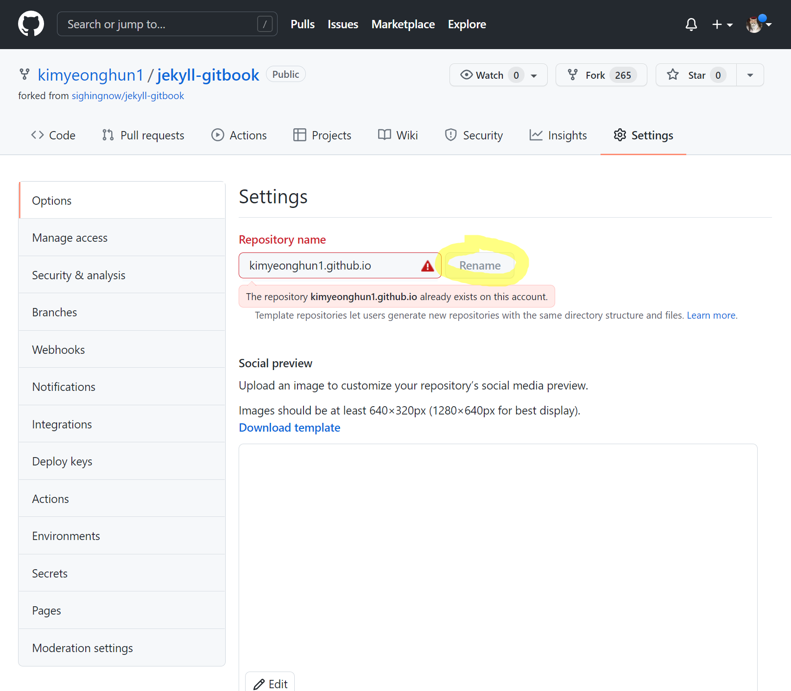
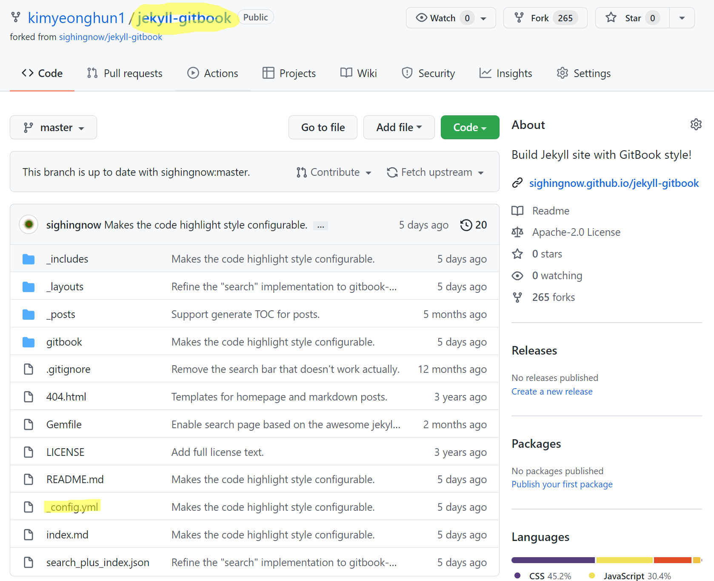
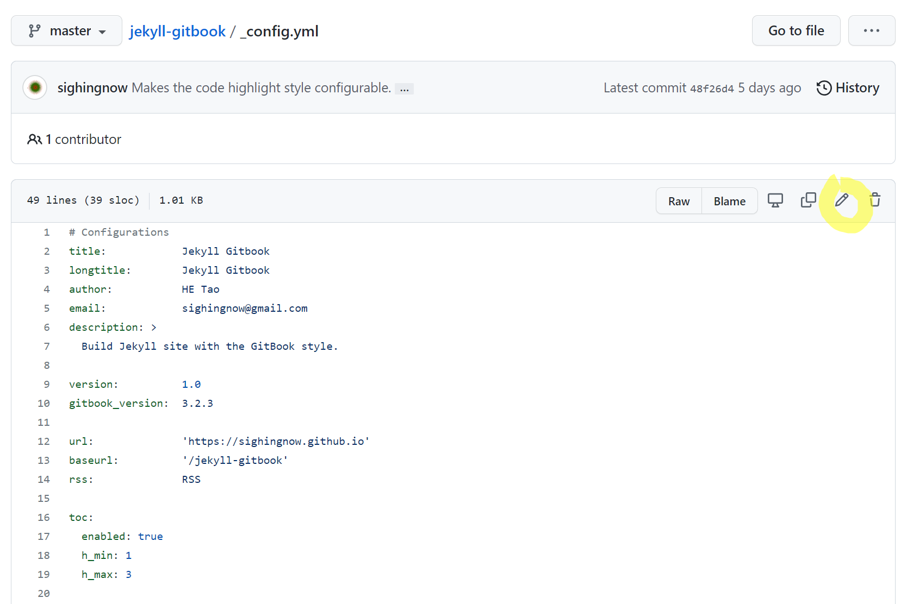
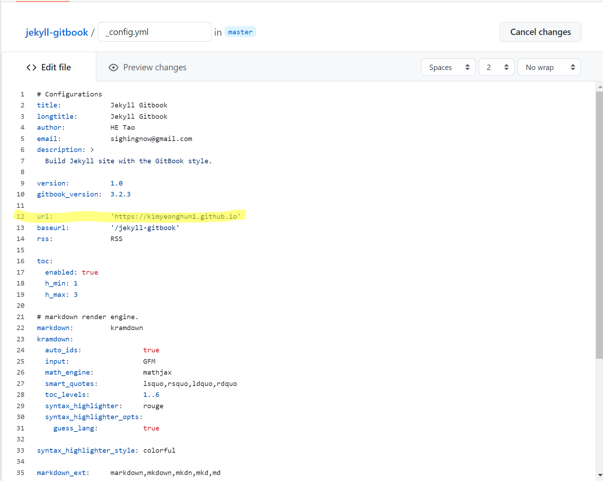
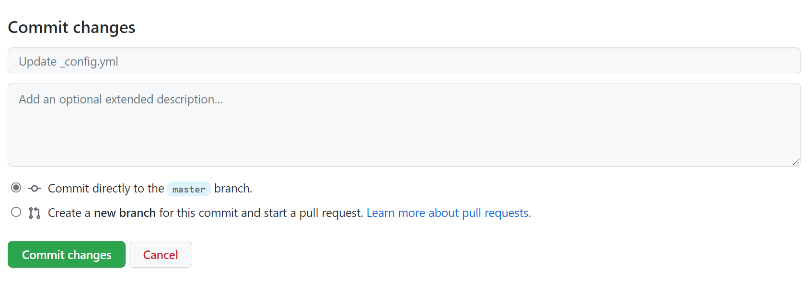
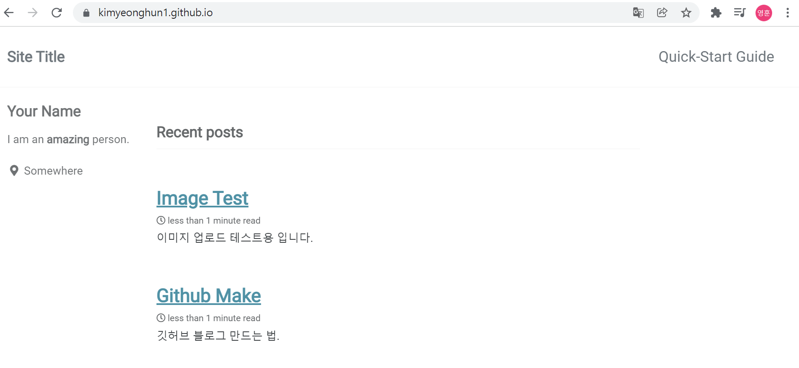

# 깃허브 블로그 만드는 법.

Jekyll을 이용한 깃허브 블로그 생성법이다. 몇 가지의 방법이 있었지만 가장 간단한 방법이 아래와 같다.

[jekyllthemes.org](jekyllthemes.org) 로 들어가서 마음에 드는 테마를 고릅니다!

테마를 고른 후 Homepage를 눌러 파일이올려져 있는 깃허브로 이동합니다!

깃허브 로그인 후 좌측 상단에 Fork를 누릅니다!

 내 레포지토리에 방금 전 파일이 그대로 복사가 됩니다.

오른쪽 Settings에 들어갑니다!

Repository name을 자신의깃허브닉네임.github.io로 바꾸고 Rename을 눌러줍니다. 이게 앞으로 사용할 깃허브 블로그의 주소가 됩니다. 저는 이미 깃허브 블로그로 사용하는 레포지토리가 있어서 경고창이 뜨네요!

다시  레포지토리 화면으로 돌아와서 상단에 jekyll-gitbook이 깃허브닉네임.github.io로 바뀌어 있을 겁니다.

  _config.yml 파일을 클릭해서 열어줍니다!

오른쪽 연필모양 Edit this file을 눌러 편집 모드에 진입합니다!

다른곳은 건드릴 필요 없고 url 부분만 방금 전 Settings에서 설정했던 주소로 바꿔줍니다!

아래쪽에 Commit changes를 눌러줍시다!

그런 후 본인닉네임.github.io로 접속 해 봅시다. 블로그 페이지가 만들어져 있는 것을 확인 할 수 있습니다.

아래 테마는 minimal-mistakes 입니다!

