모두 체크해 줍니다.

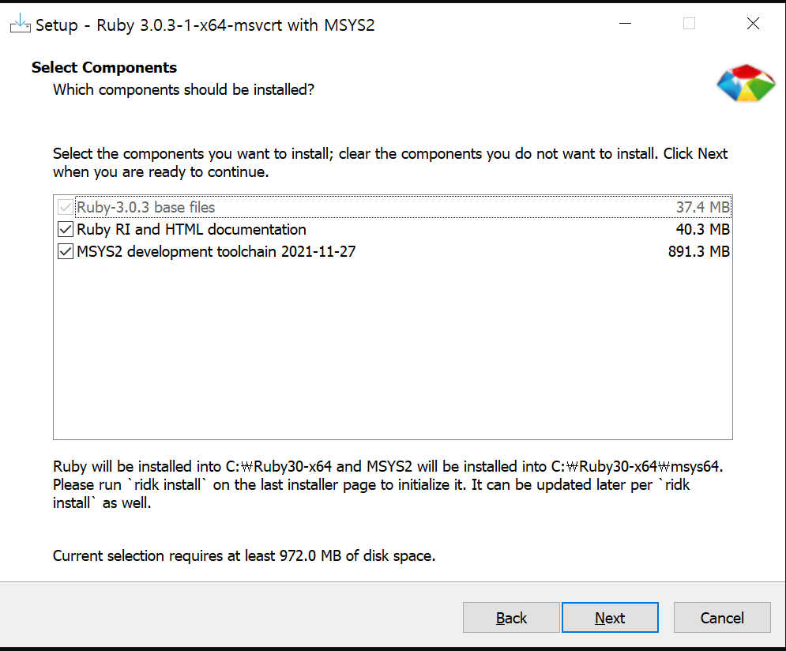


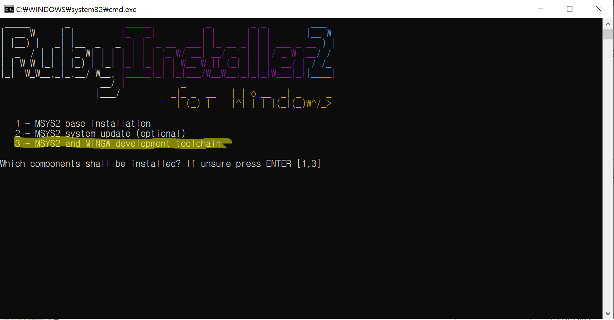


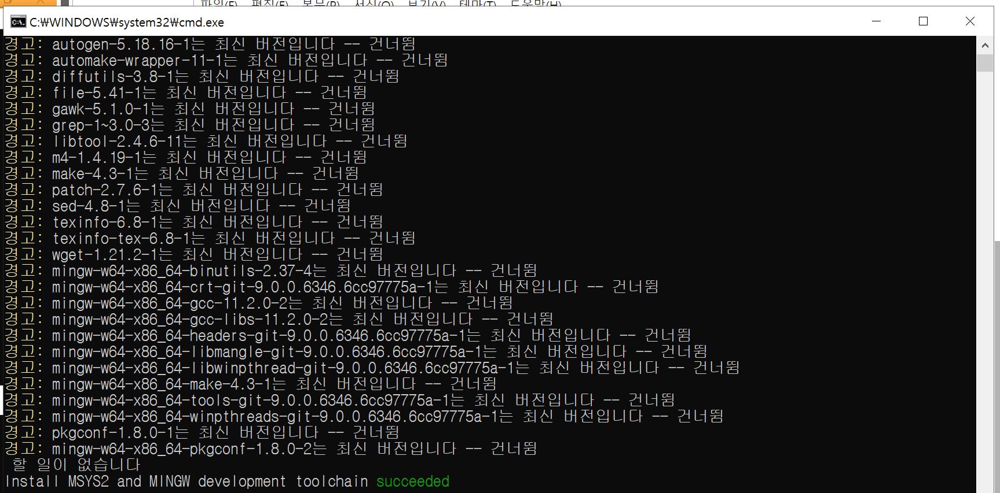


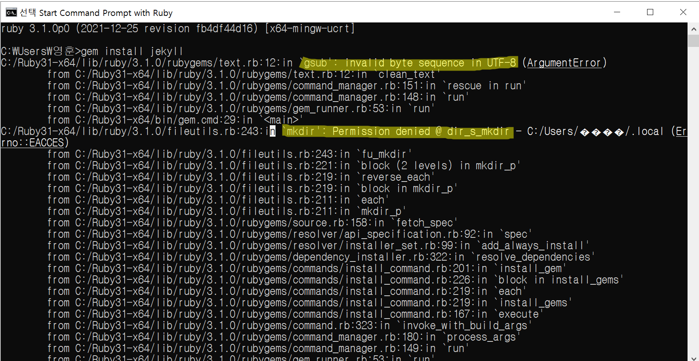


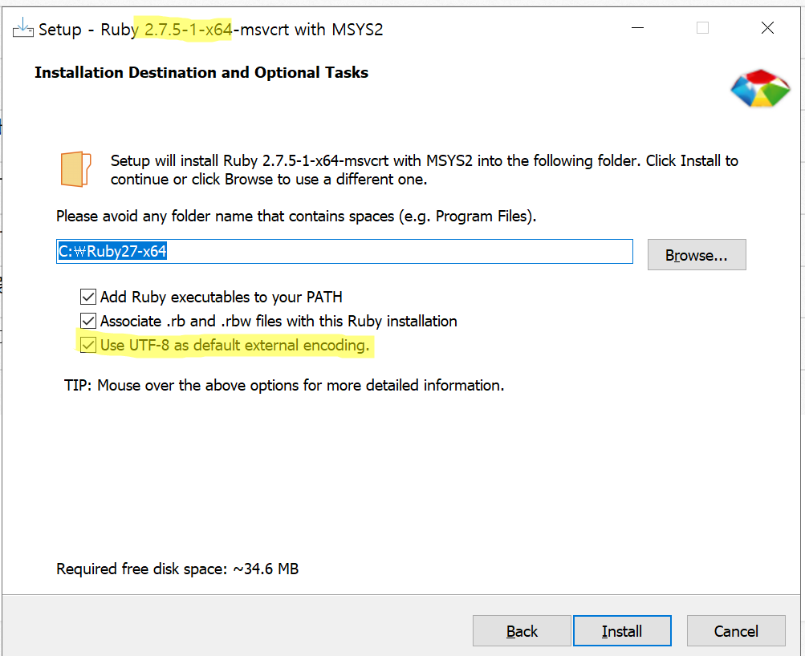


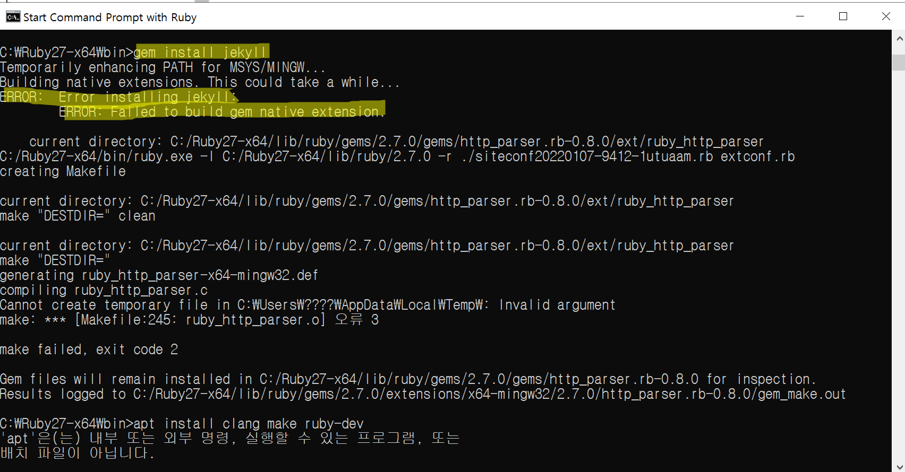


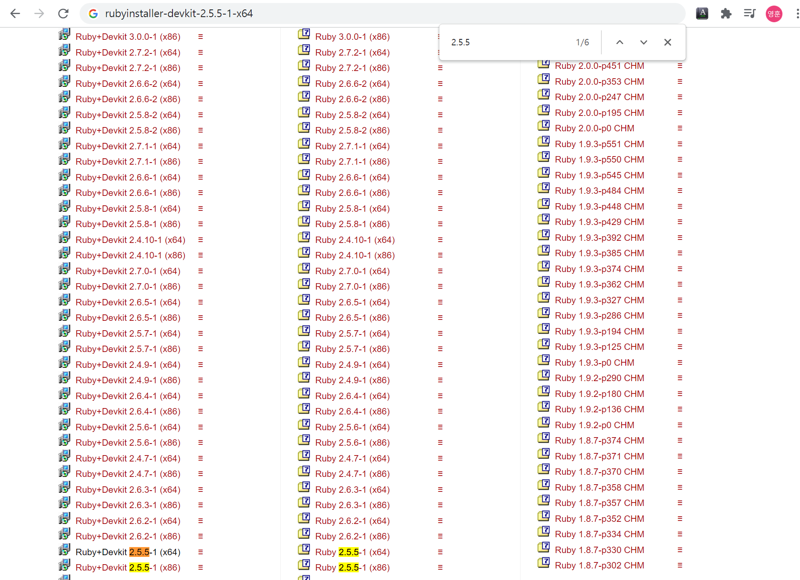


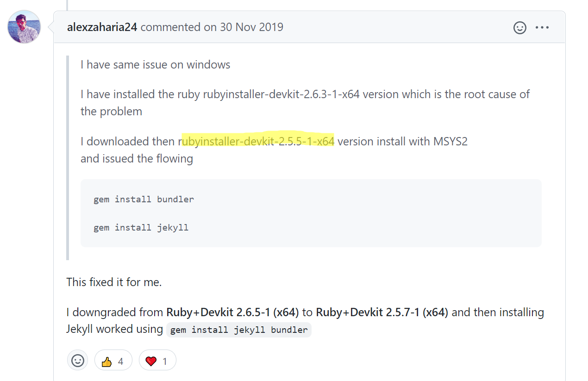


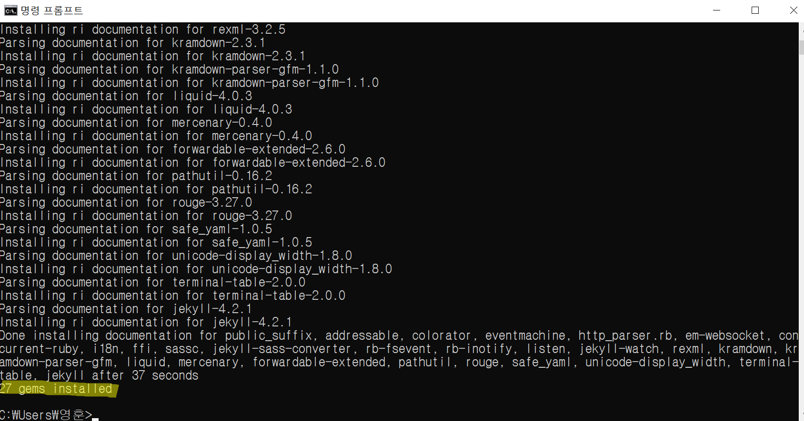


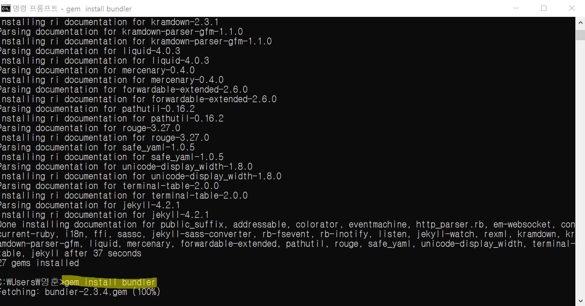


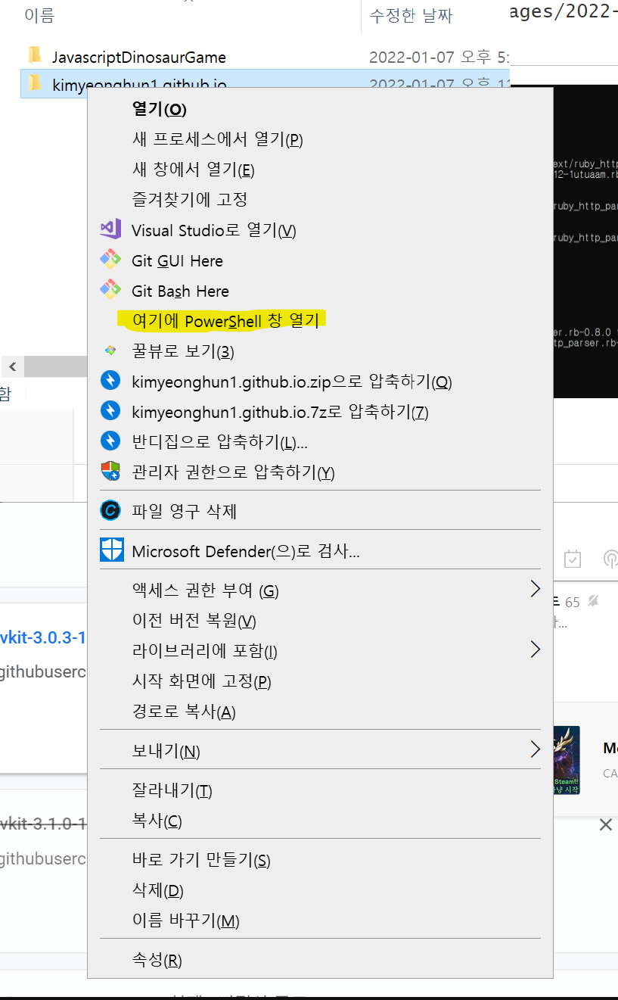


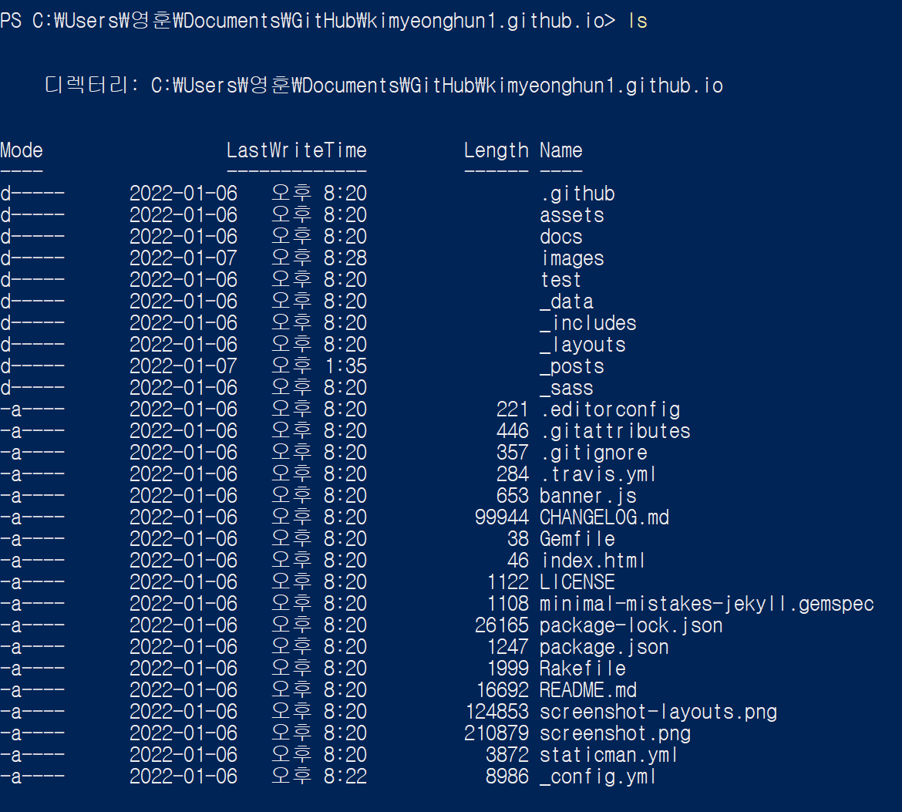


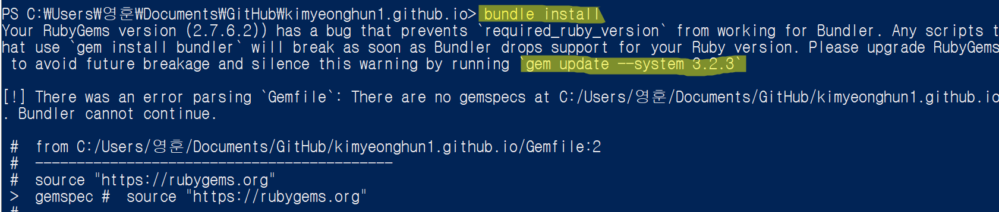


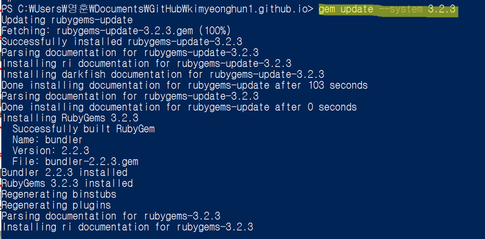


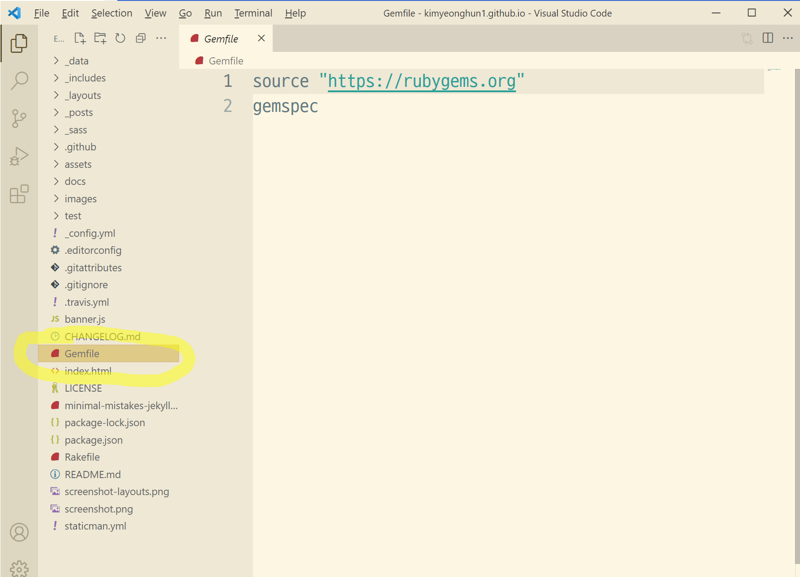


```
source "https://rubygems.org"

# Hello! This is where you manage which Jekyll version is used to run.
# When you want to use a different version, change it below, save the
# file and run `bundle install`. Run Jekyll with `bundle exec`, like so:
#
#     bundle exec jekyll serve
#
# This will help ensure the proper Jekyll version is running.
# Happy Jekylling!

# gem "github-pages", group: :jekyll_plugins

# To upgrade, run `bundle update`.

gem "jekyll"
gem "minimal-mistakes-jekyll"

# The following plugins are automatically loaded by the theme-gem:
#   gem "jekyll-paginate"
#   gem "jekyll-sitemap"
#   gem "jekyll-gist"
#   gem "jekyll-feed"
#   gem "jekyll-include-cache"
#
# If you have any other plugins, put them here!
# Cf. https://jekyllrb.com/docs/plugins/installation/
group :jekyll_plugins do
end
```


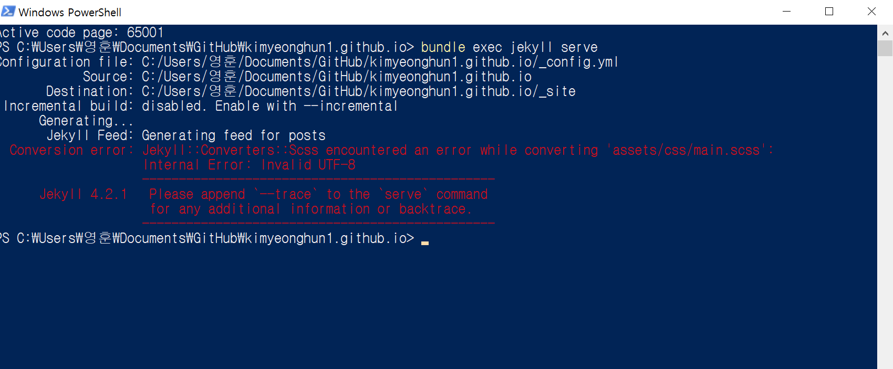