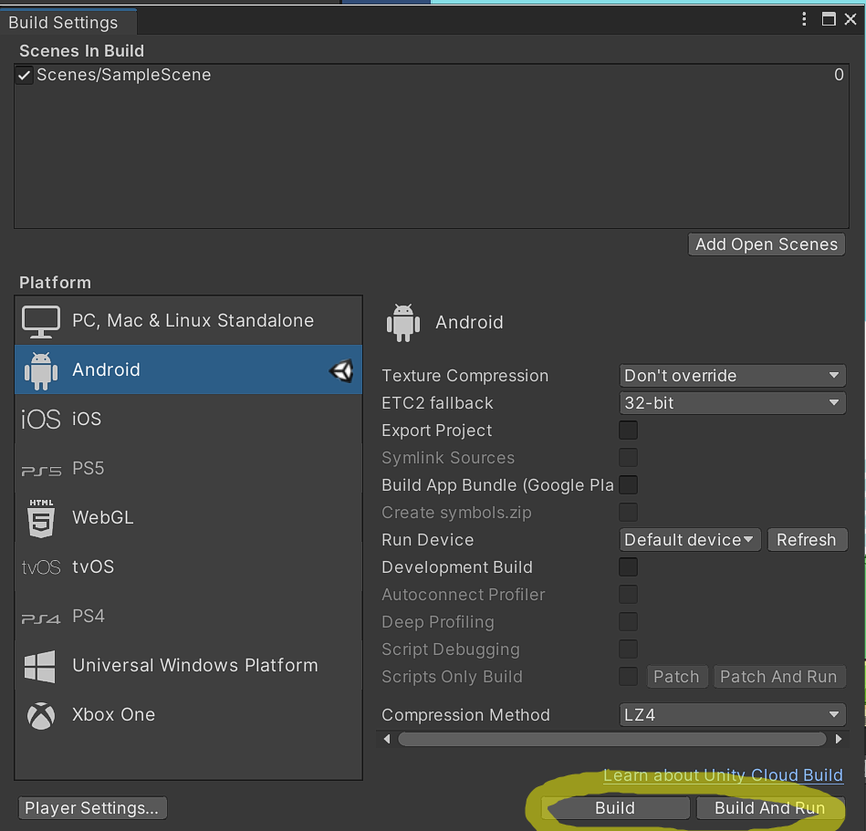
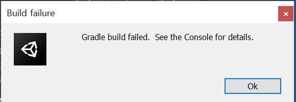
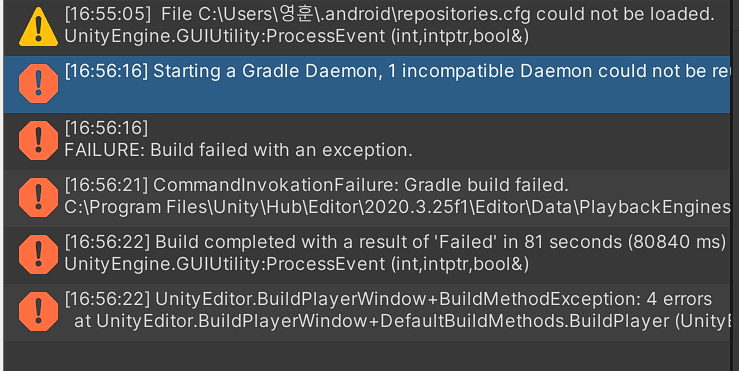
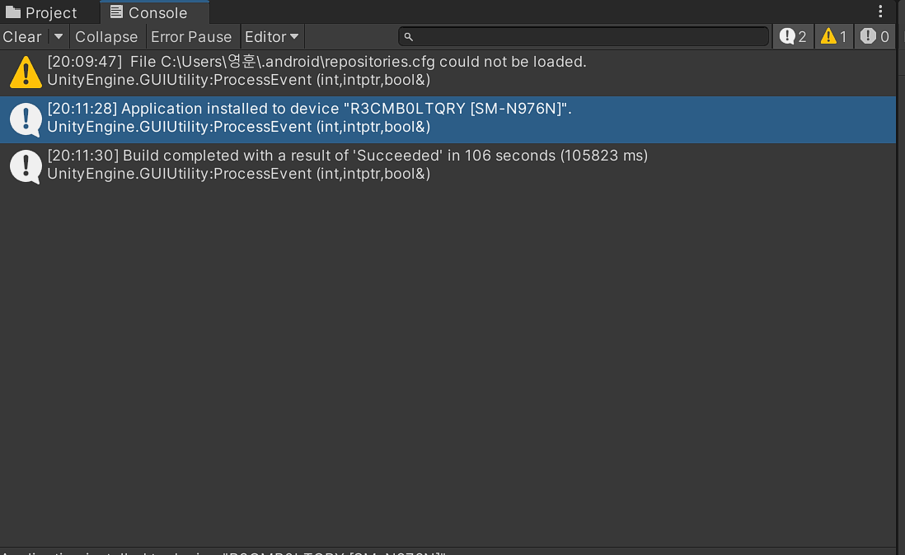

APK란 Android Package의 줄임말이다. 안드로이드에서 앱을 설치하는 역할을 한다. 윈도우의 installer와 같은 역할을 한다.

* __발생 상황__

유니티에서 안드로이드 APK를 빌드하려 할때 발생했다.

* __오류메세지__

  여러가지 오류메세지가 한번에 떠서 하나하나 찾아나가봤다.

  그 중에서도 검색시에 오류를 해결하는데 도움을 줬던 구문은

  Gradle failed to load 'native-platform.dll'이었다.

* 

* __원인__

해결은 했지만 도저히 원인을 모르겠다. sdk jdk ndk가 제대로 설치되어 있는지, 버전이 맞는지 확인하고, 폴더명 경로에 한글이 들어가 있는지도 확인하고, Android Studio를 다시 깔아서 SDK 를 최신버전으로 설치하기도 했는데도 해결이 안되던게 폴더를 지우기만 하니 해결되니 뭐가원인인지 모르겠다.

* __해결방법__

  검색 하던중 유니티 공식 포럼에 올라와 있는 답변을 발견했다.

  <https://forum.unity.com/>

  

C드라이브 안에 있는 .gralde폴더를 지운후 다시 Build하니

정상적으로 스마트폰에서 앱이 실행됬다.