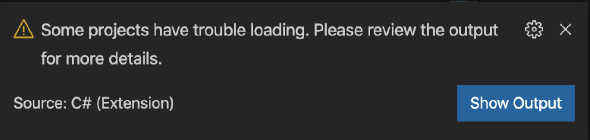
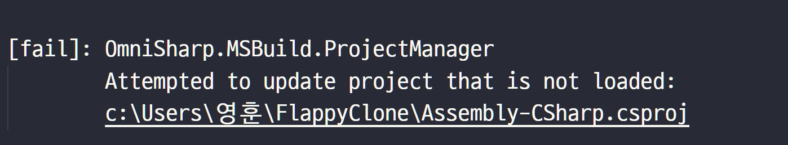
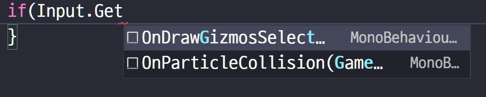
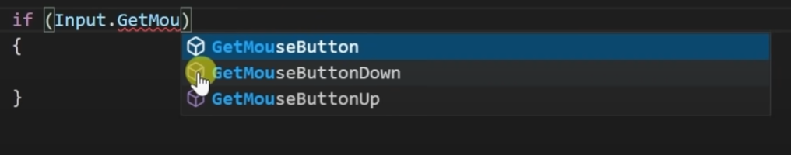
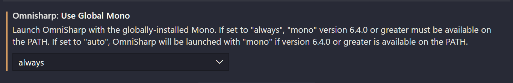
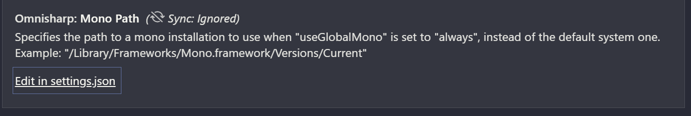
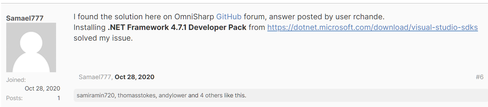
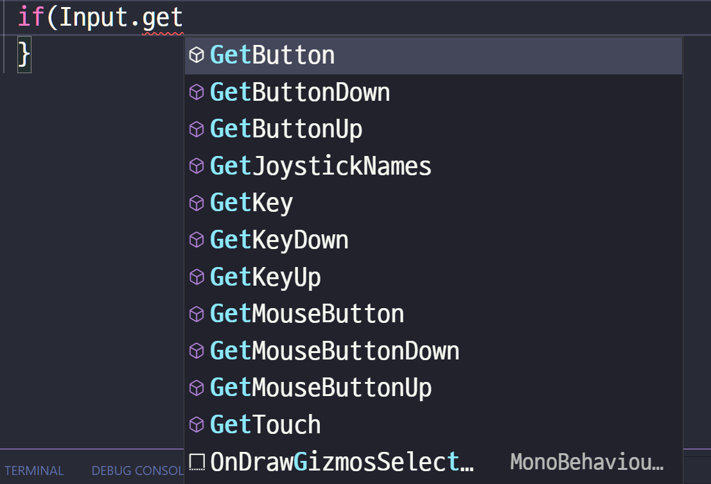

# VScode와 Unity 연동 시 자동완성 안될때

* __오류 내용__
  유니티 개발중 VScode 상에서Rigidbody2d 를 이용해 터치시 점프하기 기능을 구현 하던중 다음과 같은 오류가 발생했다.

* __오류 증상__
  코드 자동완성이 되질 않는다.
  정상이라면 아래와 같은 코드 힌트가 주어져야한다.
  

* __해결_

VScode의 File => Preference => Settings에서 mono검색 후 
아래의 부분을 auto에서 always로 바꿔준다.

여전히 해결이 안된다.

Edit in setting.json을 클릭해 파일을 열어준다.

Setting.json파일의 맨 아래쪽에
"omnisharp.path" : "latest"를 추가해준다.

여전히 해결이 안된다.

오류내용으로 검색중 .NET Framework Developer Pack을 설치해 보라는 답변을 발견했다.

아래의 링크에서  4.7.1버전을 설치하고 VScode를 재시작했다.

https://dotnet.microsoft.com/en-us/download/visual-studio-sdks

해결

머 하나 한번에 되는게 없다.