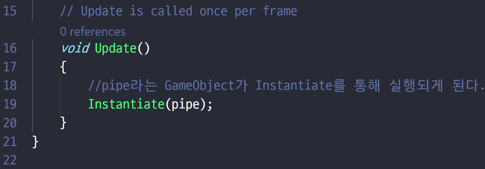
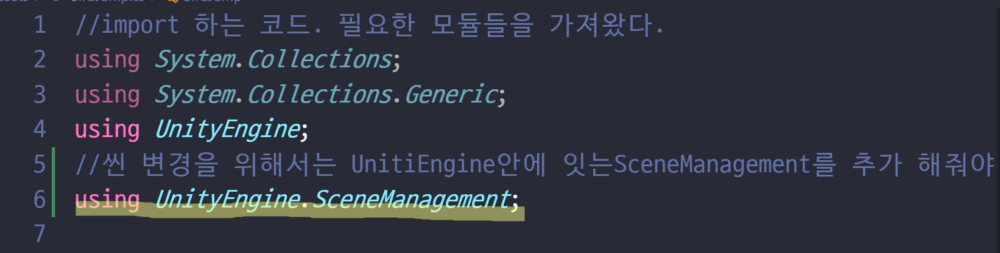

#  플레이 스토어 출시를 위한 Flappy Bird 클론코딩

* __목표__

조코딩님의 강의를 보면서 유니티의 기초적인 사용 방법을 터득한다.

VScode와 연동해서 사용되는 클래스와 함수에 익숙해진다.

 마켓 출시까지 과정을 한번 밟아본다.


유니티 설치후 2D로 새 프로젝트를 생성해 준다.


통짜 이미지파일을 다운받은후 화면 아래쪽 Assets폴더에 집어 넣는다.


이미지 파일을 따로따로 분리하는 방법은 이미지 클릭 후 Sprite Mode를 Multiple로 바꿔주고 Sprite Editor를 누른 후


 위쪽에 Slice를 연 후 Slice버튼을 누르면  이미지에 하얀 테두리가 씌워지며 각각 분할된다.


* __새가 돌아간다__

​	Collider를 이용해 부딪치게 하는 효과를 구현했지만


부딪치면 새가 돌아간다. 조금 더 개발이 되면 부딪치면 게임오버가 되서 별 상관이 없겠지만 신경쓰인다.


회전하면서 새가 돌아간다


계속 돌아가면서 날고있다.


* __Prefab__

​	Prefab을 미리 생산해 두고 Generator를 통해 내보낸다.

​	Prefab을 지정하는 방법은 끌어다가 Assets폴더에 넣으면 된다.

​	Prefab으로 지정되면 파란색으로 불이 들어온다.

​	지우더라도 Assets폴더에서 Hierachy폴더로 끌어오면 다시 Prefab으로 활용 할 수 있다.


* __Generator__


* __화면 비율__

  어느새 보니 화면 비율이 정사각형으로 바뀌어져 있다.


Game탭에 들어가면 탭 바로 아래에 디스플레이 비율을 바꿀 수 있는 창이 뜬다.

여기가 Free Aspect로 바뀌어져 있어서 나타난 현상이었다.

16:9 Portrait으로 변경해 주면 스마트폰 세로 화면 비율이 된다.


16:9 Landscape로 바꾸면 가로 화면 비율이 된다. 





Prefab을 변경했다면 항상 Inspector에서 Overrides를 해줘야 변경된 사항이 반영된다.


잘적용된 모습이다.

그런데 장에물에 새는 자꾸 돈다.


Screen Space- Overlay 는 게임에 상관없이 화면에 꽉 채워서 표시하겠다는 뜻이다.


Rect Trasform은 화면 크기에 상관없이 위치를 지정하게 해준다.

Anchor를 기준으로 거리를 측정하기 때문에 화면 사이즈에 상관 없이 UI를 배치할 수 있도록 해준다.


Anchor를 0,0 1,1로 지정해주면 화면 전체를 감싸는 캔버스를 만들 수 있다.


Trasform위치를 0,0,0,0으로 하면 왼쪽 상단에 문구가 표시된다.


Inspector의 아래쪽에서 설정사항을 변경할 수 있다. Alignment를 조절해 상하정렬과 좌우정렬을 할 수 있다.


min과 max를 이용해 Anchors의 위치를 조정해준다.  y의 min 값이 0.8이라는 아랫쪽 80%부터 시작하겠다는 의미이다.


Assets의 C#문서를 더블클릭해도 바로 VScode로 파일이 열린다.


Pipe 프리팹 안에 Scoreup이라는 빈문서를 만들고 Inspector상에서 Add Component를 눌러 Box Collider 2D 속성을 추가해 준다. Is trigger를 체크해준다.


Collider에는 Collision과 Trigger 두 가지가 있는데 앞서 만들었던 새나 파이프 같은 경우 Collision을 줘서 충돌을 구현했다면 Trigger는 관통시 무언가 일어나게 한다.


ScoreUp에서 Add Component를 클릭하여 New Script를 만들고 아래와 같은 코드를 넣어준다.


```c#
private void OnTriggerEnter2D(Collider2D other){
    Score.score+=1;
}
```

onTriggerEnter는 무언가 들어올 때 반응한다. 

방금 만들어 놓은 Score파일 안에 Score변수를 static으로 선언했으므로 ScoreUp파일에서도 Score변수를 사용 가능 하다. +=1을 해줘서 점수가 1점씩 올라가도록 해주자.


Hierachy안 Prefab에 아래와 같이 네모+표시가 있다면 Prefab에 변경점이 있는데 아직 반영이 안됬다는 표시이다


Prefab을 클릭해서 Inspector창에서 Overrides를 클릭.  Apply All을 눌러 적용해주면 +표시가 사라지는 것을 확인 할 수 있다.


게임을 실행시켜 보면 뭔가 이상하긴 하지만 파이프를 통과할 때마다 1점씩 점수가 올라간다.

여담으로 게임을 재생하는 도중에도 VScode상에서 저장을 하면 저장 사항이 바로 반영된다.


* __게임오버__

  현제까지 SampleScene 안에서 작업을 하고 있었고 게임오버를 구현하려면 기둥에 부딪쳤을 때  게임오버 화면으로 넘어가게 해야한다.


File -> New Scene을 눌러 새로운 씬을 만든다.


만들어진 씬을 Save Scene As 로 저장해준다.


UI- Canvas를 새로 만들어 주고 그 안에 다시 UI-Panel을 만들어준다. Panel에 Source image에다 배경 이미지를 끌어와 넣어준다.


Panel 안에 UI-Image 를 만들어 주면 이미지 틀이 생성된다.

Source Image에 넣고자 하는 이미지를 드래그 해 준다.

처음에는 이미지 비율이 찌그러져서 들어갈탠대 Preserve Aspect를 체크해 주면 원래 모양대로 나온다.

이 이미지 역시 Rect Transform의 Anchors를 이용해 xy min max를 조정해서 상대적인 위치를잡아준다.

min max값을 변경하면 Left, Right등의 값이 변하는데 이를 0으로 바꿔줘야 위치가 조정이 된다.


UI-Text에서 점수와 베스트 점수도 동일한 방법으로 만들어 준다.

UI-Button에서 버튼을 만들어 준다. 기본적으로 같이 생성되는 Text는 지워줘도 된다.

역시 Preserve Aspect로 비율을 제대로 맞춰 준 후 Anchors를 이용해 위치를 조정해준다. 하다보니까 크기를 변경 안해도 알아서 Anchors의 y축 차이의 크기만큼 크기가 넓어진다는 걸 알 수 있었다.


다시 PlayScene으로 돌아가서 씬 변경을 위해  아래와 같은 코드를 import해준다.

```c#
using UnityEngine.SceneManagement;
```





씬을 불러오는 코드이다.


File-Build Settings에 들어가 GameOverScene을 드래그 해서 추가해 준다.


Hierachy에 Replay를 추가해 주고 Add Component로 Replay라는 스크립트를 하나 만들어 준다.


Replay스크립트에 아래의 코드를 넣어준다.

```c#
public void ReplayGame(){
        SceneManager.LoadScene("PlayScene");
    }
```


Button에 Inspector창에서 on Click()에 방금 만들어준 Replay를 드래그해준다. 주의할점은 C#파일이 아닌 Hierachy안에 있는 파일어야 한다. 그러면 우리가 방금 입력한 코드가  ReplayGame() 함수의 형태로 나타나 있는 것을 볼 수 있다.  


점수를 GameOverScene에 표시해주기 위해 CurrentScore라는 

