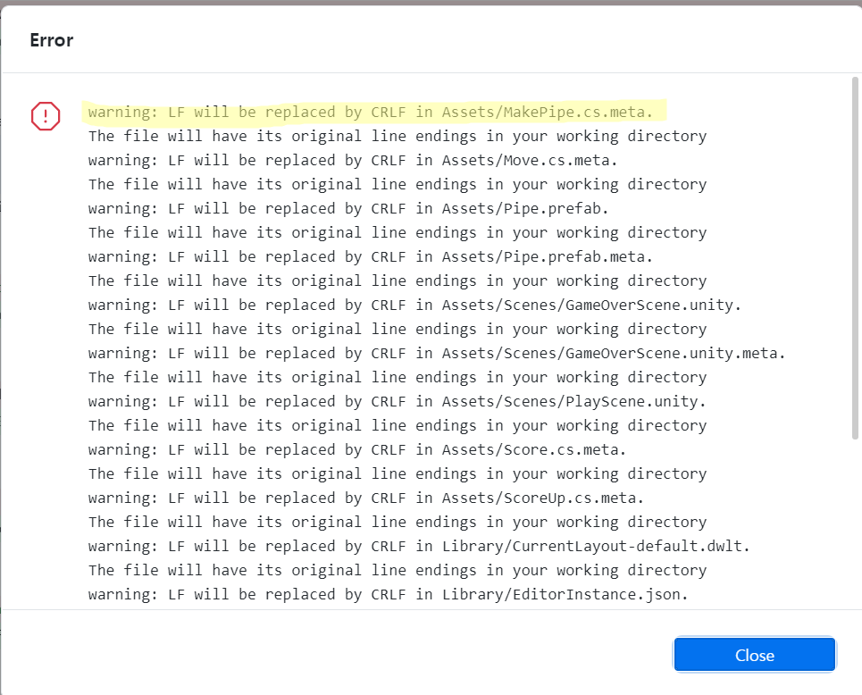
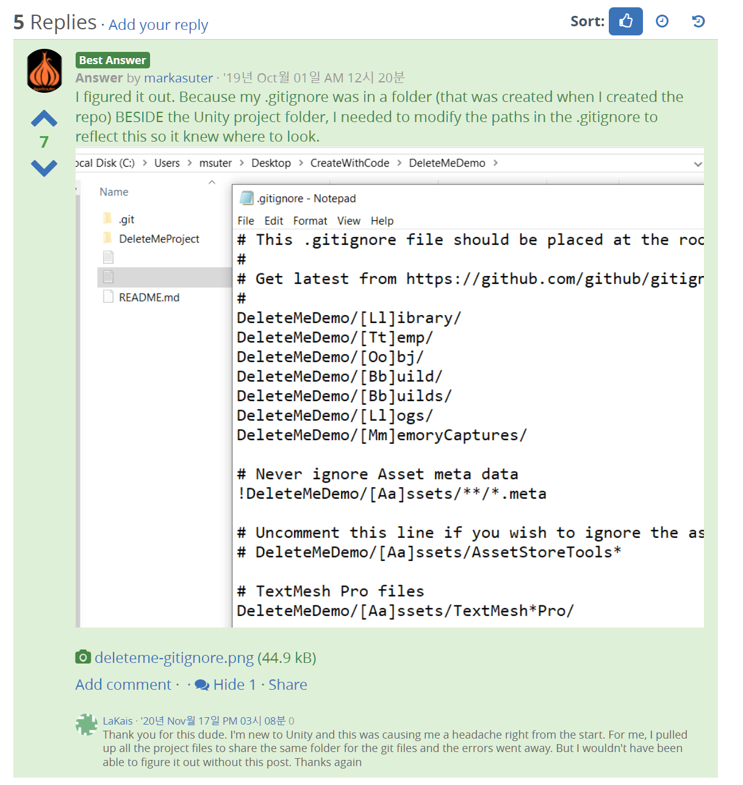
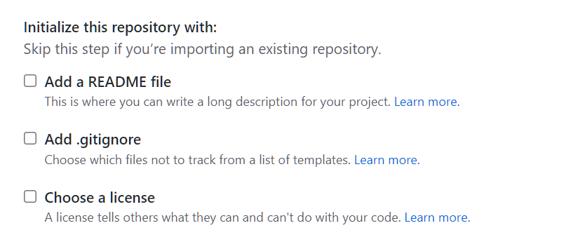
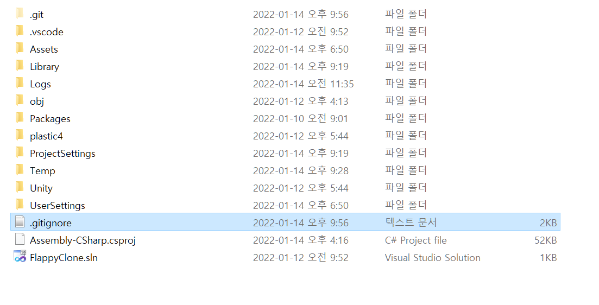
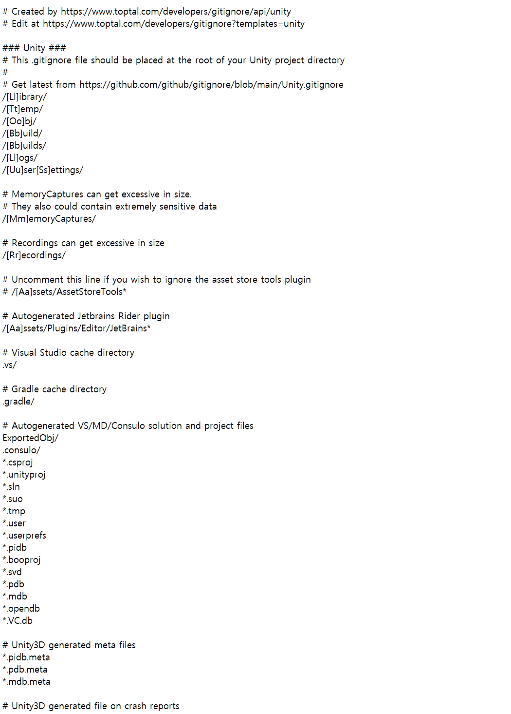
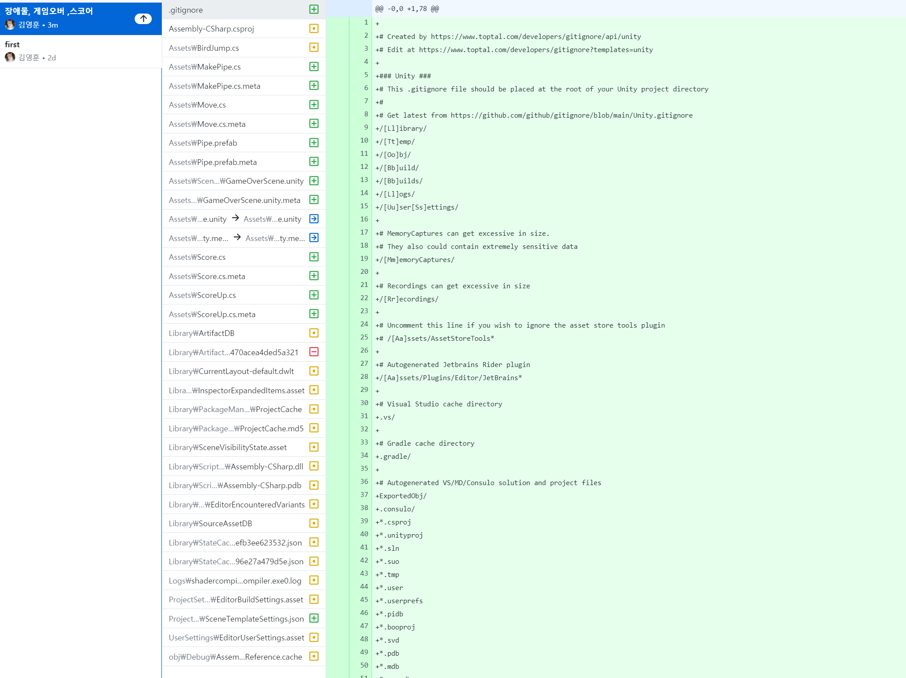

# warning: LF will be replaced by CRLF

유니티로 만들고 있던 Flappy Birds 클론 게임을 깃허브 데스크탑에서 커밋하려고 하니 아래와 같은 문구가 뜨면서 커밋이 되질 않는다.

> ```
> warning: LF will be replaced by CRLF
> ```




* __원인__

  LF CRLF 오류는 윈도우와 리눅스의 개행 차이에 의해서 발생한다.  보통 리눅스 개발자와 윈도우 개발자가 Git으로 협업할때 발생한다고 하는데 나는 혼자 작업하는데 왜 이런 오류가 나타났는지 이해가 되질 않는다.

  리눅스,맥은 LF이고 윈도우는CRLF이다. 더 자세히 찾아보고 싶지만 지금 수준에서는 이정도만 알고 있는게 좋을 듯 하다.


* __해결__

  

유니티 공식 홈페이지에 답변이 올라와 있다.  .gitignore 파일을 열어 경로를 프로젝트명/Assets으로 바꿔주면 된다는 내용이었는데 내 폴더에는 .gitignore파일이 없다.


 만들때 가운데 Add.gitignore를 채크하지 않아서 그런가보다. 다음부터는 꼬박꼬박 체크하도록 해야겠다.




다시 설정해서 자동으로 만들어지게 할 수 있나 찾아봤지만 그런 방법은 없었다. 

https://www.toptal.com/developers/gitignore 사이트에서 기본적인 소스를 제공해 준다. 

생성 창에 UNITY를 넣고 생성해준다.


.git이 있는 폴더에 텍스트파일을 만들고 이름과형식을 .gitignore로 바꾸고 위에서 생성된 소스코드를 붙여넣어준다. 





아래는 생성된 소스코드다. 여기서 뭘 건들어야 할지 고민하던 중 일단 저장하고 커밋을 한번 해보고 싶어 커밋을 누르니




어이없게도 커밋에 성공했다.




추가로 아래와 같은 해결법도 있었다. LF와 CRLF를 자동으로 변환해 주는 기능이다.

```
git config --global core.autocrlf true
```

시스템 전체가 아닌 해당 프로젝트에만 적용하고 싶다면 --global을 빼주면 된다.


