#  Bootstrap을 사용한 반응형 웹의 기초

두 개의 프로젝트 진행시 Bootstrap을 사용해 웹페이지를 구성한 경험이 있지만 워낙 정신없이 필요한 부분만 해결해 나가다보니 자세히 학습하지 못해 아쉬움이 남았다.  블로그를 작성하면서 복습겸 더 자세히 차근차근 알아보고자 한다. 


## 기본 설정

<https://getbootstrap.com/docs/5.1/getting-started/introduction/>

위 링크에 들어가면 있는 Starter template이다. 복잡해 보이지만 주석과 긴 링크를 빼고 생각해보면 하나의 CSSlink와 하나의 Javascript script태그를 넣어주면 된다.

```html
<!doctype html>
<html lang="en">
  <head>
    <!-- Required meta tags -->
    <meta charset="utf-8">
    <meta name="viewport" content="width=device-width, initial-scale=1">

    <!-- Bootstrap CSS -->
    <link href="https://cdn.jsdelivr.net/npm/bootstrap@5.1.3/dist/css/bootstrap.min.css" rel="stylesheet" integrity="sha384-1BmE4kWBq78iYhFldvKuhfTAU6auU8tT94WrHftjDbrCEXSU1oBoqyl2QvZ6jIW3" crossorigin="anonymous">

    <title>Hello, world!</title>
  </head>
  <body>
    <h1>Hello, world!</h1>

    <!-- Optional JavaScript; choose one of the two! -->

    <!-- Option 1: Bootstrap Bundle with Popper -->
    <script src="https://cdn.jsdelivr.net/npm/bootstrap@5.1.3/dist/js/bootstrap.bundle.min.js" integrity="sha384-ka7Sk0Gln4gmtz2MlQnikT1wXgYsOg+OMhuP+IlRH9sENBO0LRn5q+8nbTov4+1p" crossorigin="anonymous"></script>

    <!-- Option 2: Separate Popper and Bootstrap JS -->
    <!--
    <script src="https://cdn.jsdelivr.net/npm/@popperjs/core@2.10.2/dist/umd/popper.min.js" integrity="sha384-7+zCNj/IqJ95wo16oMtfsKbZ9ccEh31eOz1HGyDuCQ6wgnyJNSYdrPa03rtR1zdB" crossorigin="anonymous"></script>
    <script src="https://cdn.jsdelivr.net/npm/bootstrap@5.1.3/dist/js/bootstrap.min.js" integrity="sha384-QJHtvGhmr9XOIpI6YVutG+2QOK9T+ZnN4kzFN1RtK3zEFEIsxhlmWl5/YESvpZ13" crossorigin="anonymous"></script>
    -->
  </body>
</html>
```


구조는 기본적인 html 페이지에

```html
<link href="https://cdn.jsdelivr.net/npm/bootstrap@5.1.3/dist/css/bootstrap.min.css" rel="stylesheet" integrity="sha384-1BmE4kWBq78iYhFldvKuhfTAU6auU8tT94WrHftjDbrCEXSU1oBoqyl2QvZ6jIW3" crossorigin="anonymous">
```

위의 css link가 head부분에 들어가 있고

```html
<script src="https://cdn.jsdelivr.net/npm/bootstrap@5.1.3/dist/js/bootstrap.bundle.min.js" integrity="sha384-ka7Sk0Gln4gmtz2MlQnikT1wXgYsOg+OMhuP+IlRH9sENBO0LRn5q+8nbTov4+1p" crossorigin="anonymous"></script>
```

위의 JavaScript src가 바디 태그의 가장 아랫부분에 들어가 있다. 

CSS와 JavaScript 두줄의 코드만 붙여 넣으면 Bootstrap에서 제공하는 기능들을 사용 할 수 있다. 

의아했던점이 코드를 찾아 보던중 자바스크립트의 위치를 head부분에 넣는 사람도 있고 body태그의 가장 아랫쪽에 넣는 사람도 있다는 점이다.


## JavaScript의 위치


JavaScript는 head부분과 body태그 가장 아랫부분에 삽입 될 수 있다.

* head부분에 삽입되는 경우

```html
<head>
	<script 코드내용></script>
</head>
```

형식으로 들어가며 브라우저 로딩시에 head부분 먼저 실행되므로 무거운 자바스크립트가 실행되는경우 로딩이 길어진 다는 단점이 있다.

* body태그의 가장 아랫부분에 삽입되는 경우

```html
<body>
    ......
	<script 코드내용></script>
</body>
```

위와 같은 형식으로 들어가며 브라우저 로딩이 완료된 상태에서 스크립트가 실행되기 때문에 화면에 노출된 체로 스크립트가 변경될 수 있게 해준다. 대부분의 자바스크립트 위치로 추천되는 위치이다.


## Container

> Our default `.container` class is a responsive, fixed-width container, meaning its `max-width` changes at each breakpoint.

콘테이너 클래스는 반응형이고 넓이가 고정된다. 각 브레이크포인트마다 최대 넓이가 변경된다고 한다. 이해가 잘 안된다. 아래의 예시를 보자.


```html
<div class="container">
  <!-- Content here -->
</div>
```

container라는 class선택자를 주기만 하면 간단히 적용된다. 각 class에 대한 정의는 bootstrap에서 제공하는 CSS파일에 모두 정의되어 있다. 방금 전 head태그 안에 붙여넣었던 코드 말이다. 

그래도 궁금하니 CSS파일을 살펴보자.

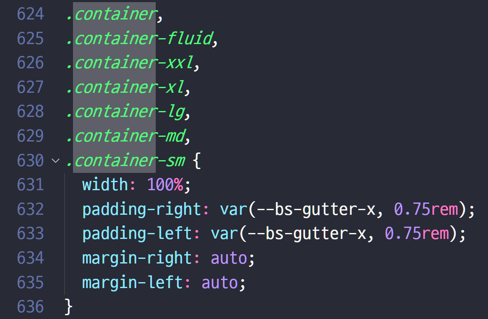

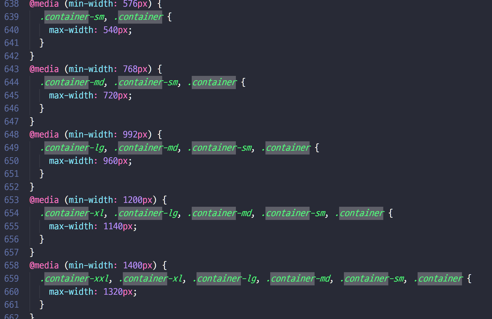

미디어의 크기에 따라 최대 넓이를 정해주는 방식인것 같다.


* 적용방법

  매우 간단하게 body 태그에 class선택자를 container로 지정해 줌으로써 사용 가능하다.

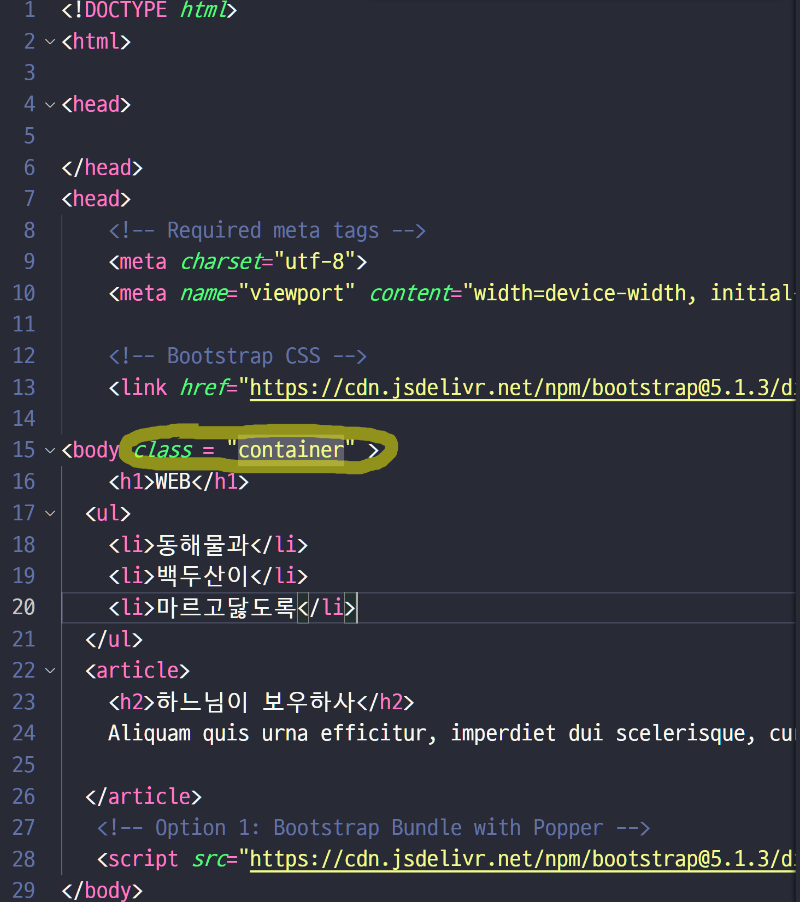


* container를 사용하기 전

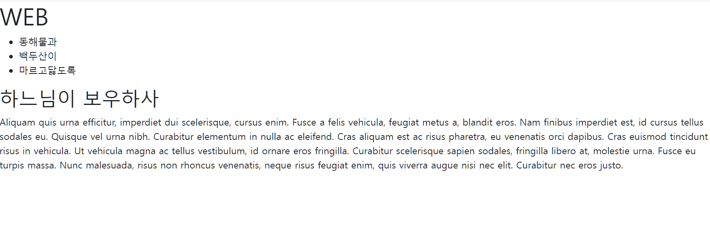

여백이 끝까지 차있다.


* container 적용 후

  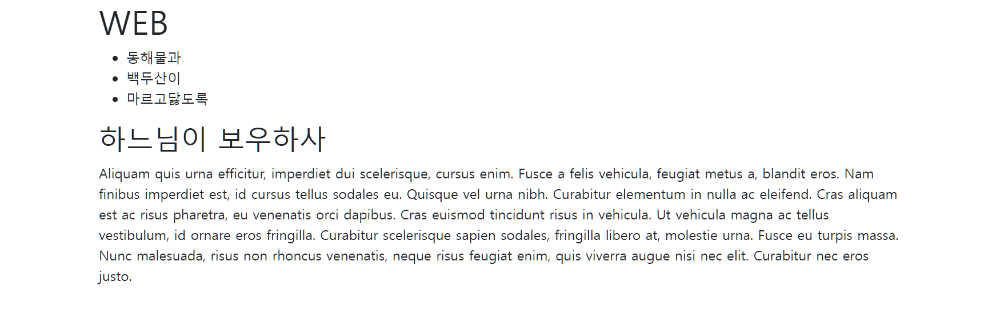

좌우로 여백이 생겼다. 조금 더 자세히 살펴보자.


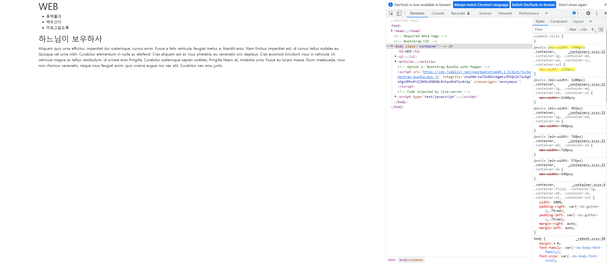


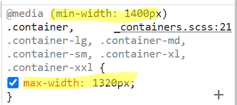


가장 최대로 키운 화면. min-width:가 1400px 이상일때  max-width를 1320px로 제한해 여백이 생긴다.

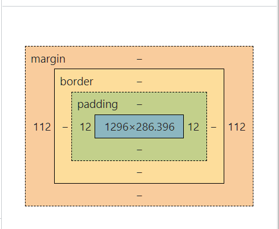

화면 크기를 늘였다 줄였다 하면 마진과 패딩이 자동으로 설정되어 들어간다.


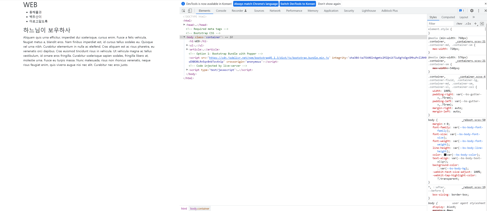

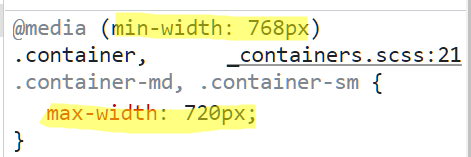

화면을 작게 줄인경우. 즉 min-width가 768px 이상일때 max-width를 720px로 제한해 좌우로 여백이 만들어진다.


일정 크기 이하로 줄이면 가독성을 위해 여백이 만들어 지지 않는다.

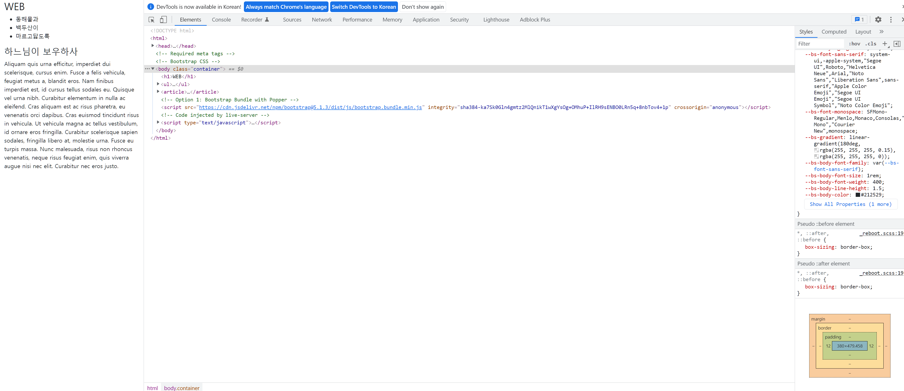


## Grid

> Use our powerful mobile-first flexbox grid to build layouts of all shapes and sizes thanks to a twelve column system, six default responsive tiers, Sass variables and mixins, and dozens of predefined classes.

위는 Bootstrap에서 제공하는 Grid에 대한 설명이다. 12개의 열시스템? 6개의 반응형 계층? 무슨말인지 전혀 모르겠다. 아래의 예시를 보자.


아래와 같이 코드를 작성하면 한 row에 세 개의 col이 들어간다는 의미이다. 12개의 열 시스템이란 col을 최대 12개 까지 넣을수 있다는 뜻이다. 


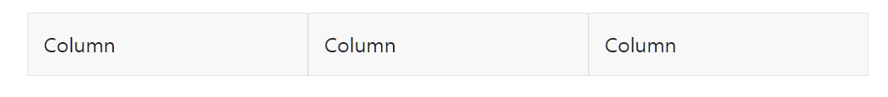

```html
<div class="container">
  <div class="row">
    <div class="col">
      Column
    </div>
    <div class="col">
      Column
    </div>
    <div class="col">
      Column
    </div>
  </div>
</div>
```


그래도 위 코드만 봐서는 어떻게 적용해야하는지 감이 오질 않는다.  실제로 적용시키는 방법은 어떤 태그든 간에 적용 시키고 싶은 태그들을 col  class로 지정해 준다. col만 지정해서는 아무런 변화도 없다.

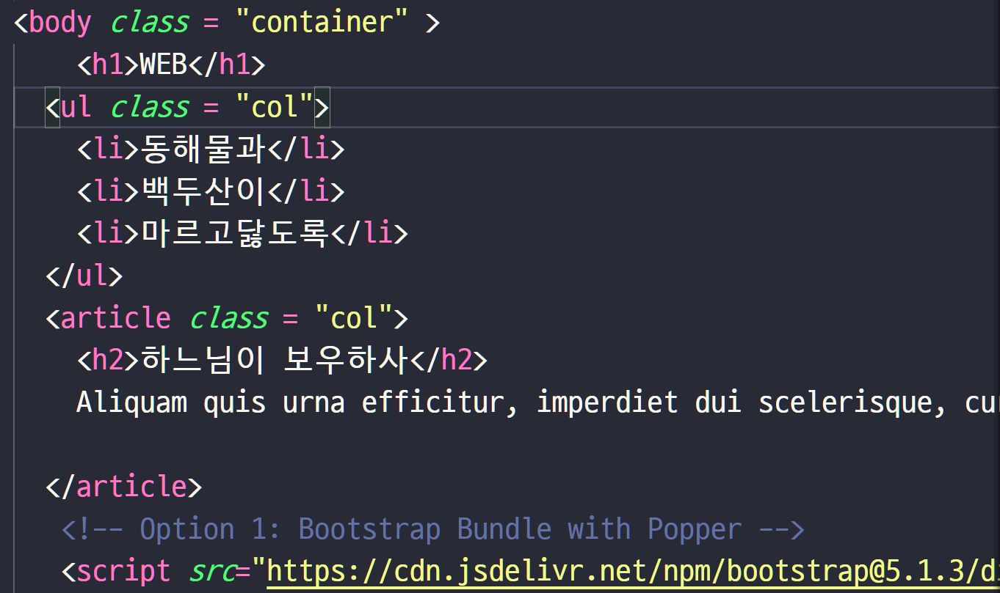


col을 사용하려면 아래와같이  사용하려는 태그들을 div 태그로 감싼 후 row클래스로 지정해 줘야 한다.

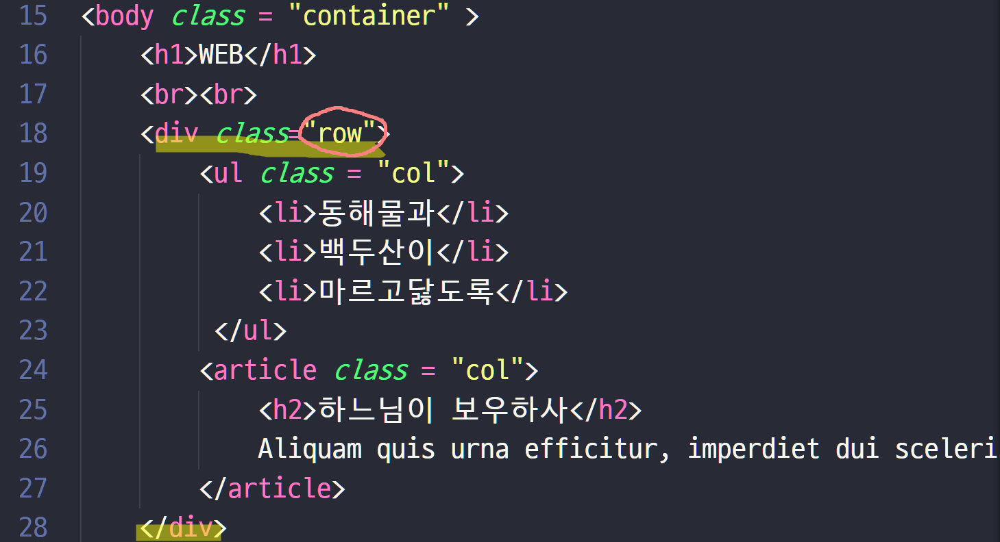


div로 감싸고 row클래스로 지정까지 하면 div태그 안에 있는 ul태그와 article태그가 1:1의 비율로 나뉘었다.

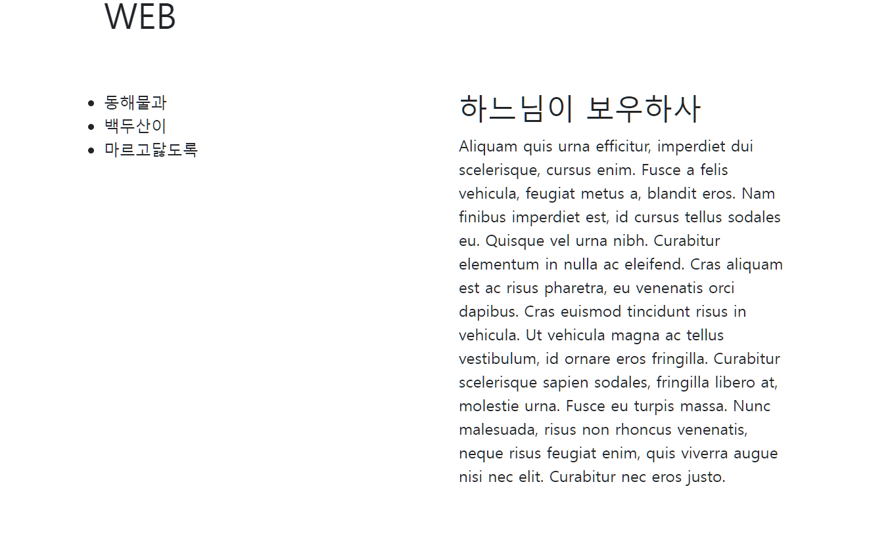

크기를 조정해도 항상 1:1의 비율을 유지한다. 이 점이 Bootstrap을 사용해서 웹페이지를 만드는 가장 큰 이유 중 하나라고 생각한다.

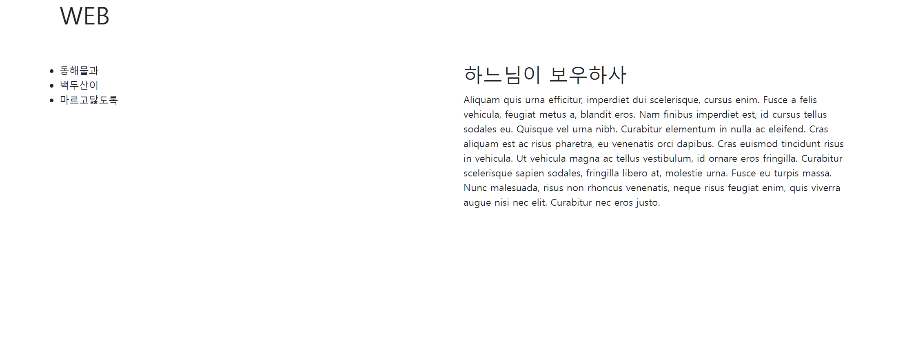

여기서 col은 col-1을 의미한다. 그래서 1:1비율이 된다. 차지하는 비율을 바꾸고 싶으면 col-2와 같이 바꾸면 된다. 아래의 코드를 통해 살펴보자. 'col-숫자'를 사용해 비율을 나눌때는 그리드의 갯수는 12이므로 합이 항상 12가 되도록 사용하면 된다. 

```html
 <div class="row">
        <ul class = "col-10">
            <li>동해물과</li>
            <li>백두산이</li>
            <li>마르고닳도록</li>
         </ul>
        <article class = "col-2">
            <h2>하느님이 보우하사</h2>
            Aliquam quis urna efficitur, imperdiet dui 
        </article>
```


총 12개의 그리드 중 ul태그가 10만큼의 비율을 차지하고 article태그가 2만큼의 비율을 차지한 화면을 볼 수 있다.

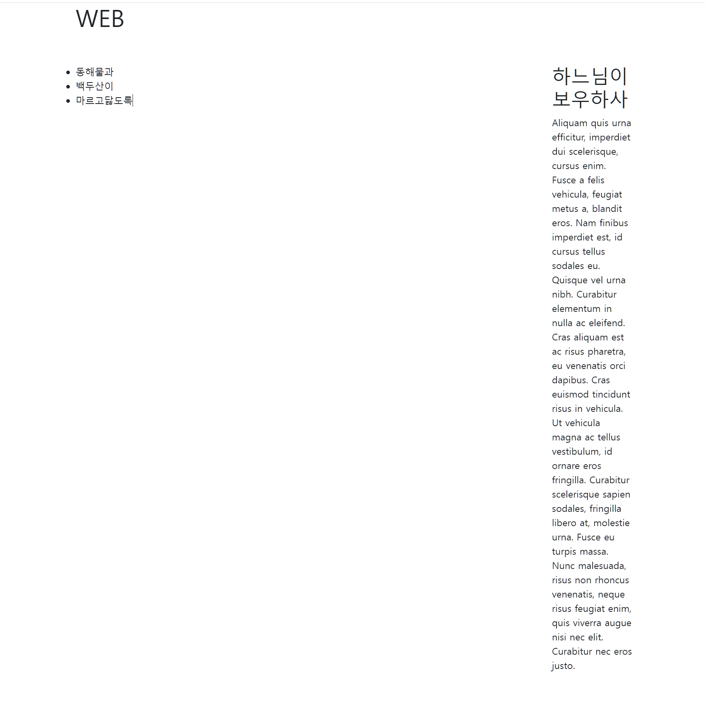

당연히 반대로도 가능하다.

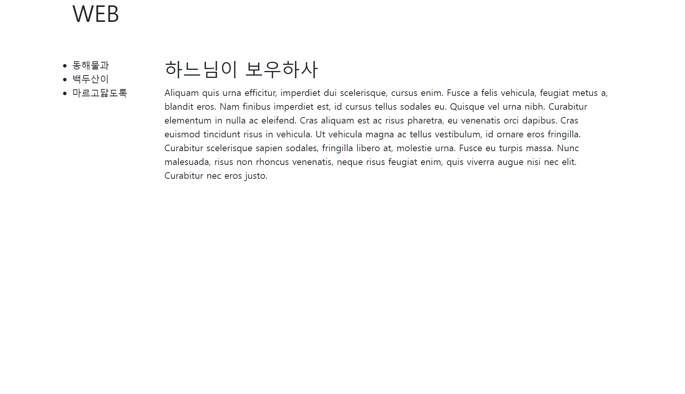

## BreakPoint

> Breakpoints are customizable widths that determine how your responsive layout behaves across device or viewport sizes in Bootstrap.

공식 홈페이에 있는 Breakpoint에 대한 설며이다. 진짜 무슨 말인지 모르겠다. 영어를 못 해서가 아니다. 정말이다.

> 중단점은 부트스트랩의 장치 또는 뷰포트 크기에서 반응형 레이아웃이 작동하는 방식을 결정하는 사용자 지정 가능한 너비입니다.

??? 여전히 무슨말인지 모르겠다.


아래의 예를 보자. 이런 레이아웃으로 화면을 구성하고 싶다. 모니터에서는 괜찮지만 스마트폰과 같은 작은 화면에서는 어떻게 보여질까? 

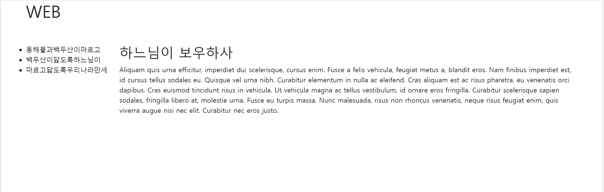


아래와 같이 글자가 밑으로 내려가 레이아웃이 예쁘지 않게 잡힌다.  이럴때는 차라리 그리드시스템 없이 분할하지 않고 보여주는 편이 보기 편할 것이다. 이럴 때 쓰는게 BreakPoint이다.

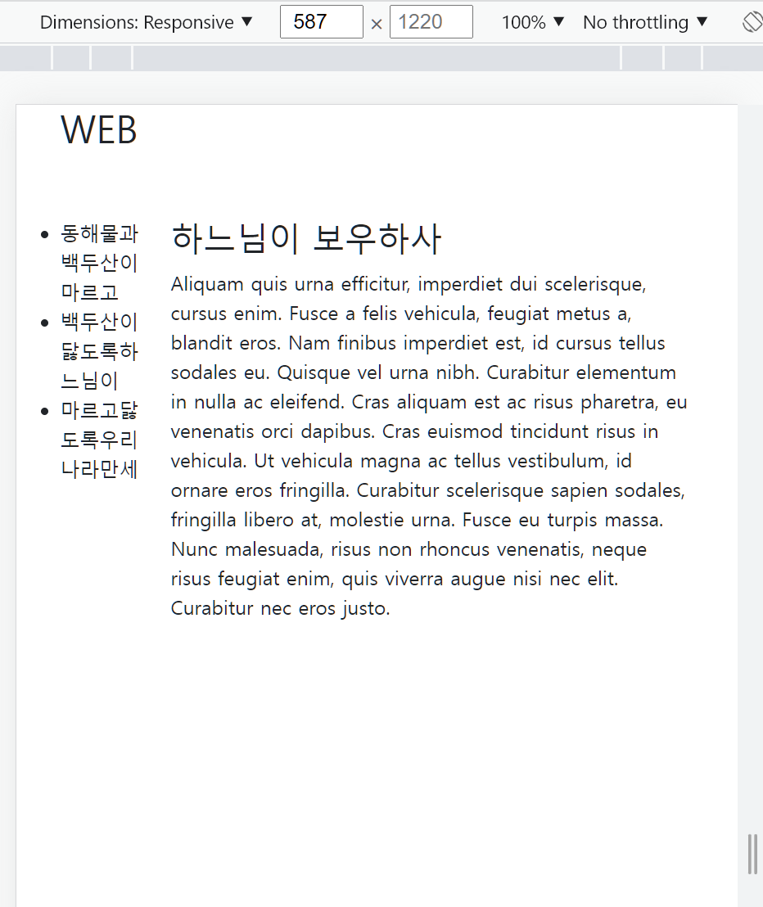


여섯가지 종류의 Breakpoint가 있다.  위의 예시에서 width가 587px이므로 아래 표에서 md라는 Breakpoint를 사용하여 width가 768px이하가 되면 그리드시스템 사용을 종료하도록 설정 해 보자.

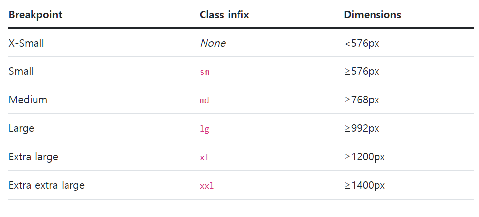


이해하기만 어렵지 사용방법은 매우 간단하다. 지정해준 col에 Breakpoint의 이름만 붙여주면 된다. 예시에서는 md라는 Breakpoint를 사용했다.

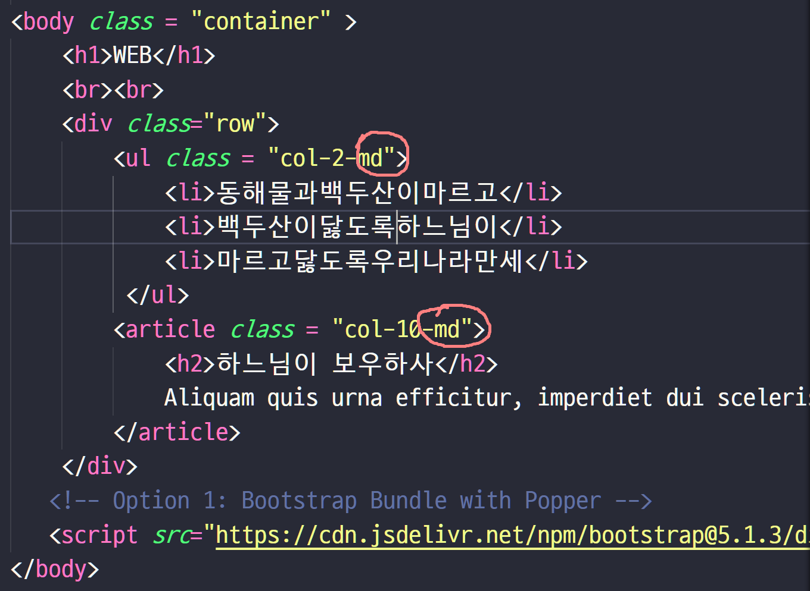


그리드시스템 사용이 중단되고 원래 구성했던 레이아웃으로 화면이 출력된다. 

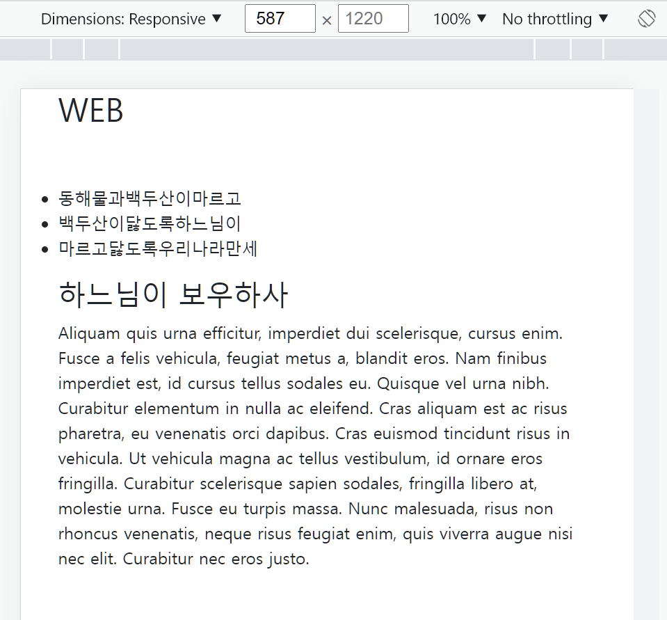


