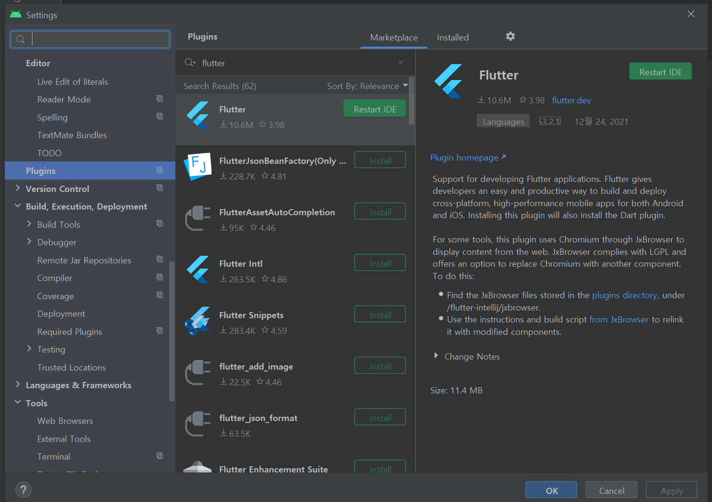
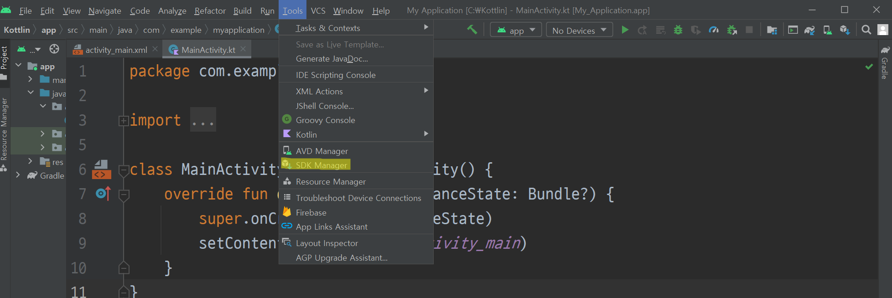
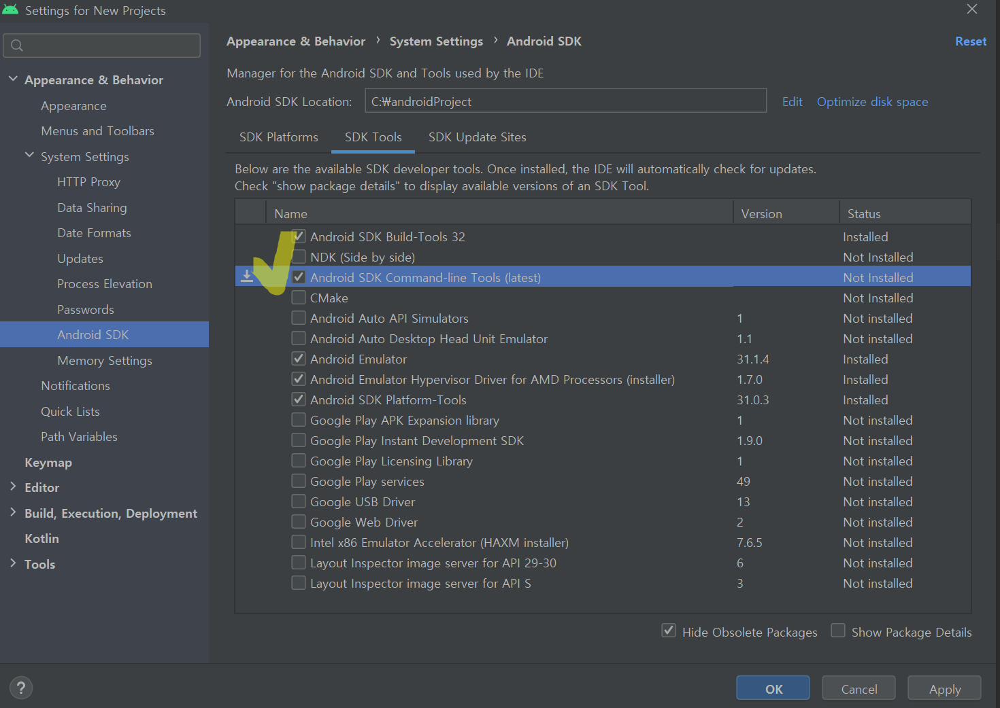
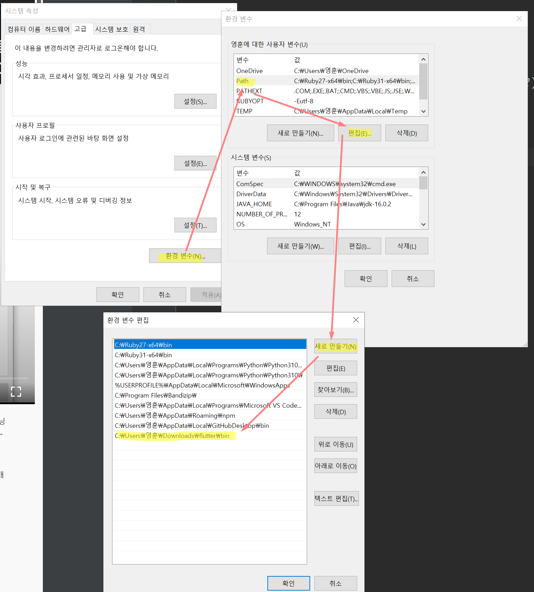

Android Studio에서 File -> Settings -> Plugins에서 flutter 검색 후 설치해 준다. 나오는 경고 창은 모두 예를 눌러준다.

Tools ->SDK Manager

SDK Tools에서 Android SDK Command-line Tools를 체크 후 Apply

이걸 설치하지 않으면 Flutter 작업 시에 Command Line Tools가 필요하다는 오류가 발생한다.

환경변수 등록일 해준다. 검색창에 환경 변수 검색 -> 시스템 환경 변수 편집 -> 환경 변수  -> Path클릭후 편집 -> 새로만들기 -> flutter 설치 폴더에 bin폴더의 경로를 입력해 준 후 확인

