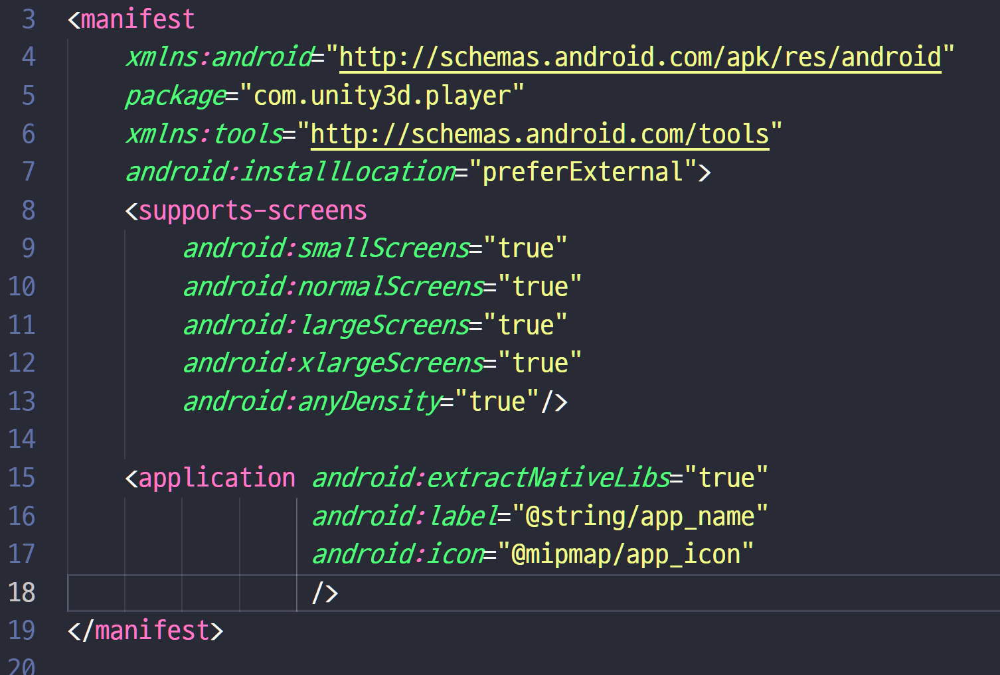

#  play store 출시를 위한 세부적인 방법, 자주 발생하는 오류


## 기본셋팅

Build App Bundle을 체크해 줘야 플레이스토어에 출시가 가능하다. 왼쪽 아래 Player Settings를 누른다.


Company Name과 Product Name을 자신의 고유한 이름으로 넣어준다.

Default Icon은 스마트폰 상에서 보여질 아이콘이다. 그림판을 이용해 512x512 사이즈로 등록했다.


아래로 내려본다. Splash Image는 앱을 처음 실행시켰을때 나타나는 화면이다. 무료버전에서는 항상 unity로고가 나타나게 되어 있다. 유료버전을 구매하면 show Unity Logo 체크를 해제 할 수 있다. 무료버전에서도 Virtual Reality Splash Image에 이미지를 넣어 유니티 로고와 같이 자신만의 이미지를 동시에 띄울 수 있다.


Other Settings 화살표를 눌러 펼친다.  Version은 업데이트 진행시 임의로 숫자를 올리면 된다. Bundle Version Code도 업데이트 진행시 1씩 증가시키면 된다.  업데이트를 했는데  Bundle Version Code를 그대로 두면 오류가 날 확률이 높다고 한다.

2021-8월부터 구글 플레이스토어 정책에 따라 Minimum API Level을 반드시 Android11(API level 30) 이상으로 설정해 줘야 승인이 난다. ARM64 또한 반드시 체크해 줘야 승인이 난다.


## Project Key 생성

Project Key란 누군가 내 앱을 함부로 수정하지 못하도록 하는 암호같은 것이다.

Publishing Settings에서 Keystore Manager를 누른다.

Keysotre Manager창에서 왼쪽위 keystore...를 눌러 Create New => Anywhere 를 눌러 원하는 위치에 파일을 저장해 준다.


파일 저장 후에 다음과 같이 창이 뜨면 비밀번호를 입력해주고 별칭을 지정해준다. 

이름과 조직단위의 이름을 임의로 지정해주고 도시, 국가, 국가코드를 입력해준다.


## Play Store에서 다운받았을 때 실행이 안되는 오류

스마트폰에서 바로 돌릴때는 정상적으로 실행이 되지만 플레이스토어에서 다운받아 실행하는 경우 실행이 안되는 경우가 있다.  해결방법은 Publishing Settings -> Build에 Custom Launcher Manifest를 체크해준다.


체크해주면 Assets -> Plugins -> Android 안에 Lauancher Manifest파일이 생성된다. 


Launcher Manifest 파일을 열어 아래의 코드를 android:icon="@mipmap/app_icon" 다음에 붙여넣어준다.



```java
android:allowBackup="false" 
android:fullBackupContent="false" 
tools:replace="android:allowBackup"
```


## build시 발생하는  오류

아래와 같은 오류가 발생하면서 build에 실패한다.


관리자 권한으로 Unity Hub를 실행하면 해결할 수 있다.


## 구글 개발자 계정을 활성화 하려면 25$가 필요해서 돈이 생기면 나머지부분을 해보겠다.

