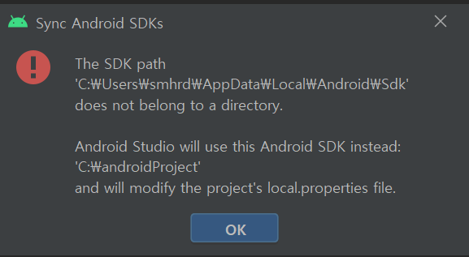
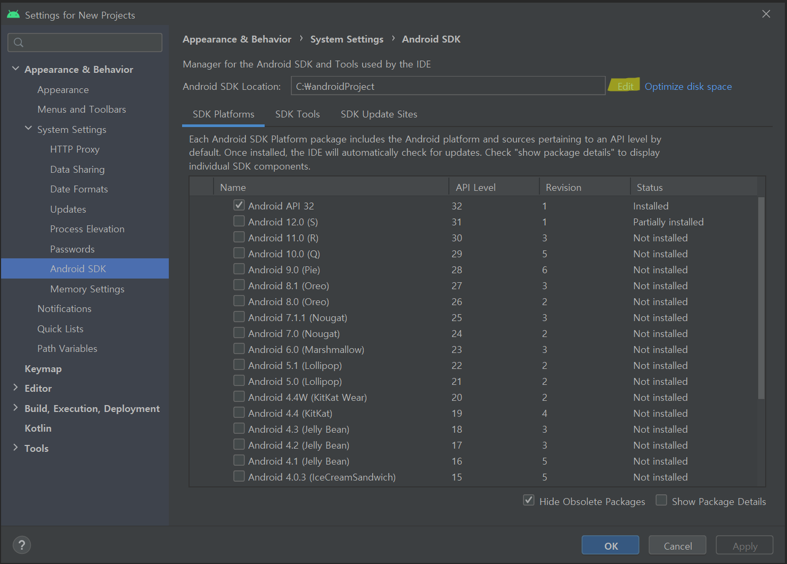
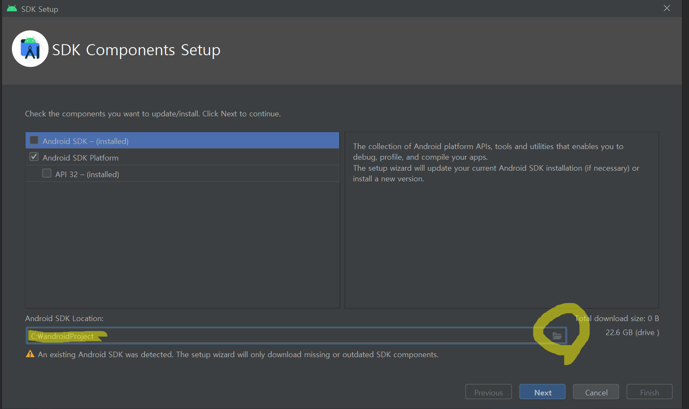
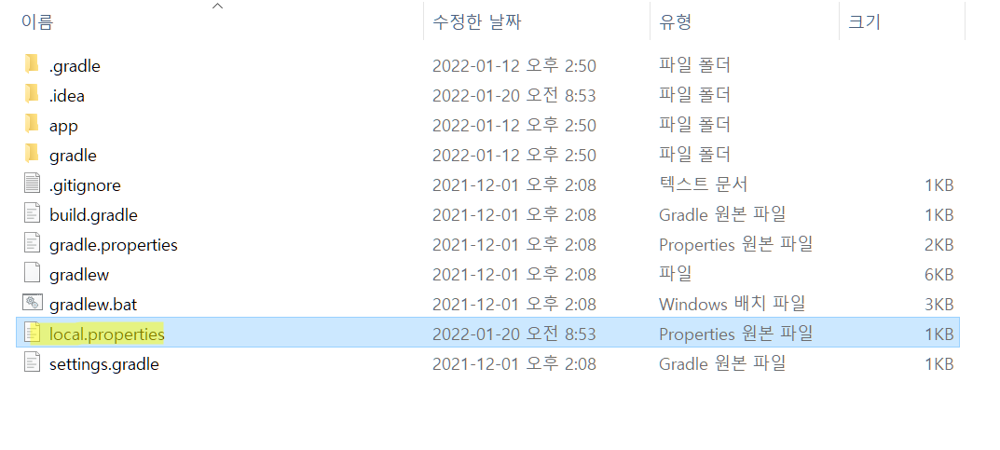
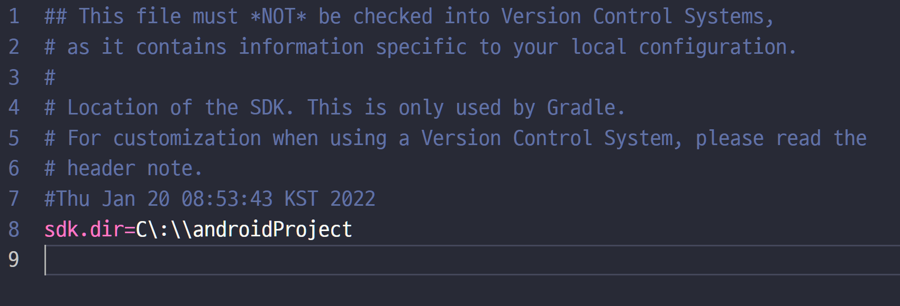

SDK란 Software Development Kit의 약자로 하드웨어프랫폼, OS, 또는 프로그래밍 언어 제작사가 제공하는 일련의 툴이다. 예를 들면 조립가능한 옷장에 들어있는 도구 키트와 같다. 일반적으로 컴파일러, 디버거, API가 포함된다. 

## 오류 내용

학원에서 만든 프로젝트를 불러오려 하는데 다음과 같은 오류창이 뜨며 불러오기에 실패했다.

## 원인

프로젝트 생성시 지정한 SDK의 위치와 현제 SDK 위치가 달라서 발생하는 오류이다.

## 해결

Tools- SDK Manager로 아래의 창을 열어준다. ->Edit클릭

아래의 경로가 현제 SDK가 설치된 경로다. 오른쪽 폴더모양 아이콘을 클릭해 원하는 경로로 지정해 준다.

안드로이드 스튜디오의 SDK의 위치를 바꾸는 방법 말고도 프로젝트에 지정되어 있는 SDK의 위치를 바꿔주는 방법이 있다.

프로젝트 폴더로 가서 local.properties파일을 연다. 아래와 같이 한줄의 코드가 있다. SDK  Manager를 열었을때 나오는 SDK가 설치된 위치를 넣어주면 정상 작동한다.

