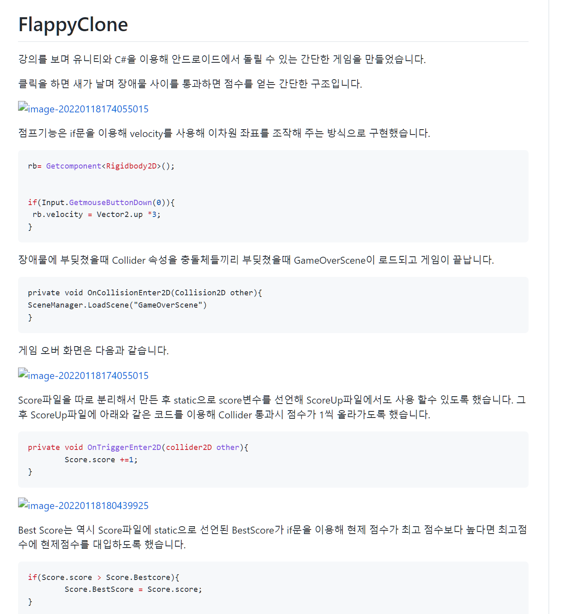
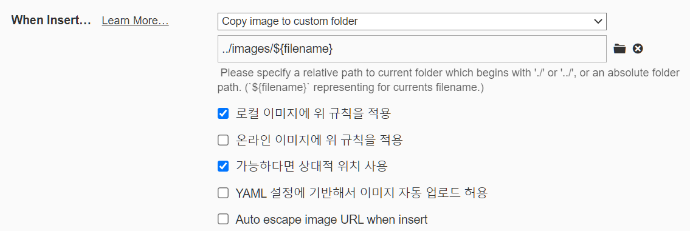
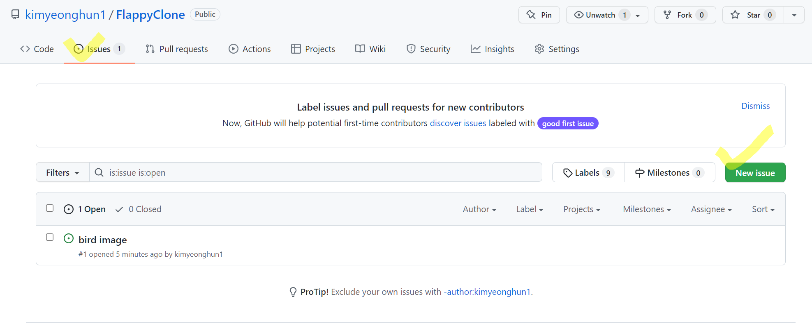
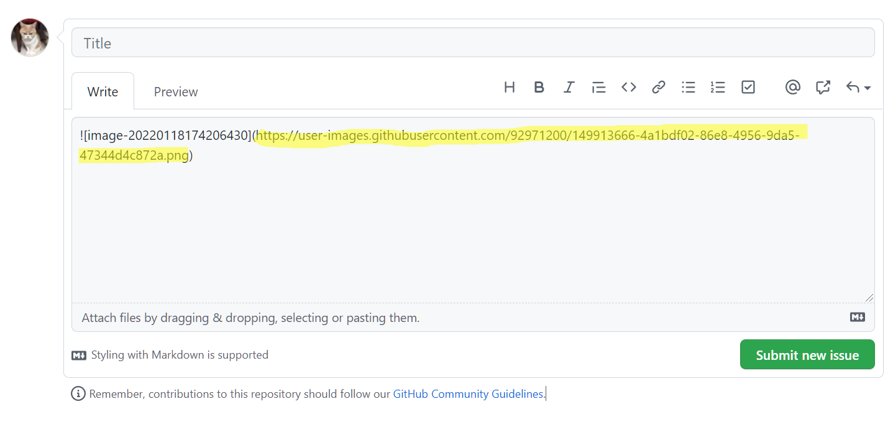

## 오류내용

타이포라에서 readme 파일 작성후 깃허브에 제대로 올라갔나 보니 이미지가 몽땅 깨져서 나온다.

## 원인

타이포라는 이미지를 다음과 같이 상대경로로 지정하는데 블로그 글 업로드 시에는 상대경로로 지정해줘도 정샂적으로 이미지가 출력됬지만 readme파일은 절대경로로 지정해줘야 제대로 보인다.

## 해결

프로젝트 내의 Issues ->New issue클릭

이미지를 드래그&드랍 하면 아래와 같이 절대 경로가 생성된다. 이걸 가져다가 원하는 위치에 마크다운 문법으로 붙여넣기 하면 된다!

