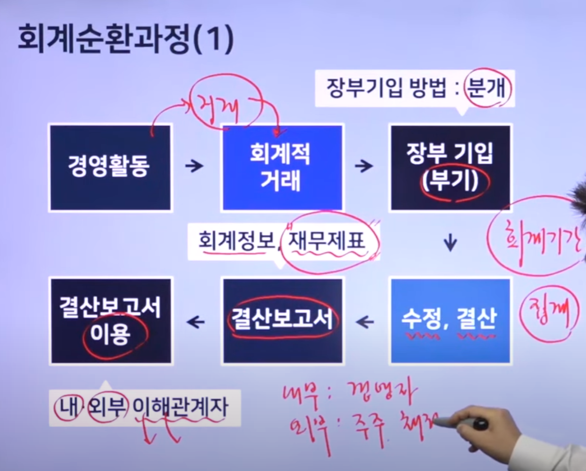
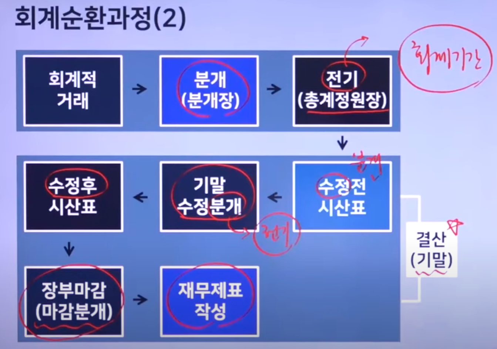
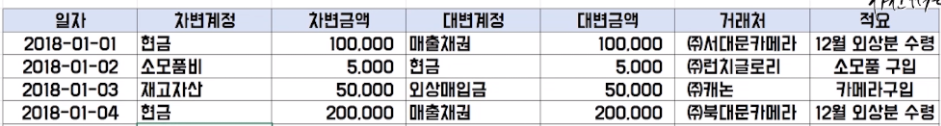
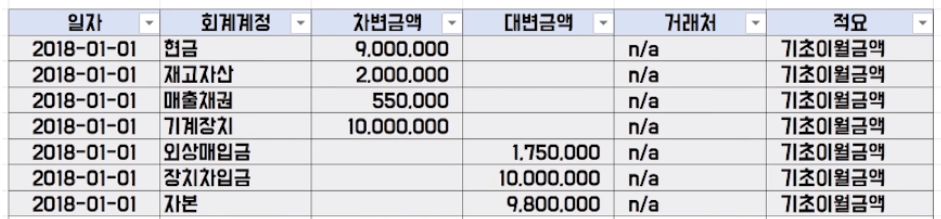
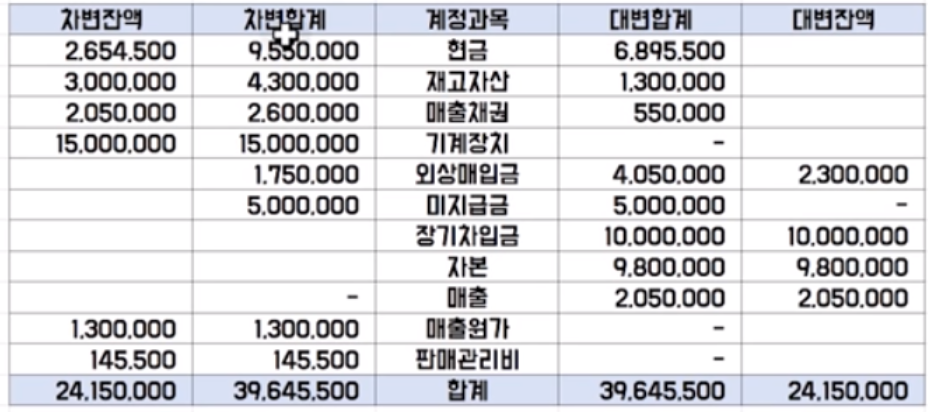
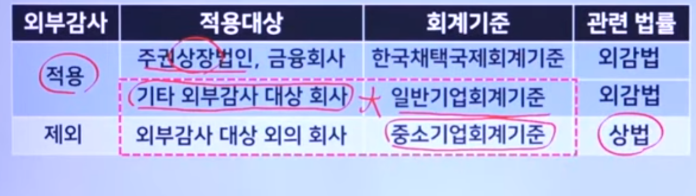

면접때문에 오랜만에 회계 공부를 해본다. 5년만에 다시 관련 용어들을 공부하니 모든게 새롭다.  중급회계, 세법까지 어느정도 다시 건드려보고 싶었지만 욕심을 내다보니 끝이 없어서 큰 흐름과 계정과목 몇가지만 준비해 가야겠다. 

## 기업의 경영활동

* 영업활동

​		투자와 재무활동 둘을 제외한 모든 활동
​		상품, 제품의 판매
​		재료, 상품매입,
​		급여

* 투자활동
  1.영업활동 에 필요한 자산(토지, 건물, 차량,기계)등을 매입하고 매각하는 활동
  2.재산 증식 목적의 투자도 포함한다.

* 재무활동
  사업자금조달(상환)하는 활동.
  자기자본조달-주식을 발행한다
  타인자본조달-부채를 발행해 조달한다

## 회계 순환과정

경영활동에서-> 회계적 거래가 일어나면 ->장부기입을 ->하고 수정,결산을 통해-> 결산보고서가 나오는데 이게 재무제표다.

## 분개

분개란 아래와 같이회계상의 거래를 차변, 대변으로 분류하고 계정과목과 금액을 적어넣는 과정. 하나의 계정과목에 차변과 대변 중 하나만 표현된다.

## 총계정원장

분개장에서 총계정원장으로 옮겨적는 행위를 전기라고 한다. 하나의 계정과목에 차변과 대변이 모두 나타난다.

## 합계잔액 시산표

합계잔액시산표는 총계정원장에서 계정별 합계와 잔액을 하나의 계정으로 모아서 보여주는 것이다.

분개장에 기입되어 있는 모든 거래의 분개가 총계정원장에 정확하게 전기 되었는지를 조사하기 위해 작성한다.

## 재무제표 

주주, 채권자등 회사의 이해관계자들에게 회사의 재무정보를 제공하기 위해 작성한다.

1. 재무상태표

2. 손익계산서

3. 현금흐름표

4. 자본변동표

5. 주석

   

   

## 우리나리 회계기준 체계

상장법인 - K-IFRS적용

비상장법인 - 일반기업회계기준, 중소기업회계기준 적용

이 중 K-IFRF적용회사와, 일반기업회계기준에 따라 장부를 작성해야 하는 회사는 외감법 감사 대상이다.

## 외감법 대상

주권상장법인, 금융회사  

직전 사업연도 말 자산 총액이 500억 이상인 회사

직전 사업연도 매출액이 500억 이상인 회사

중소기업회계기준 만족조건: 다음 중 3개 이상에 해당하지 않아야한다.

직전 자산 120억 미만, 직전 매출액 100억 미만, 직전 부채 70억 미만,  직전말 종업원수 100명 미만(일용근로자, 파견근로자 제외), 유한회사의 경우에는 정관에 기재된 사원 50명 미만

