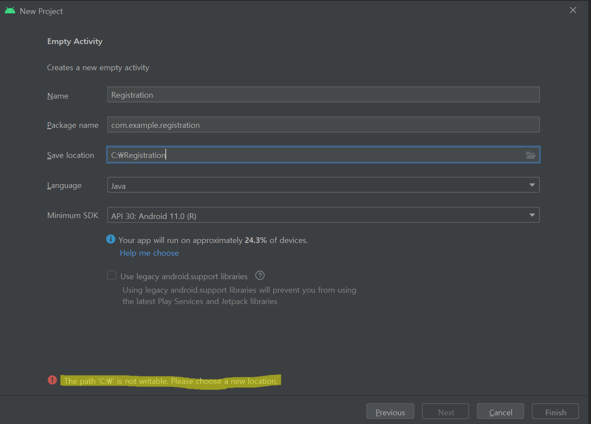
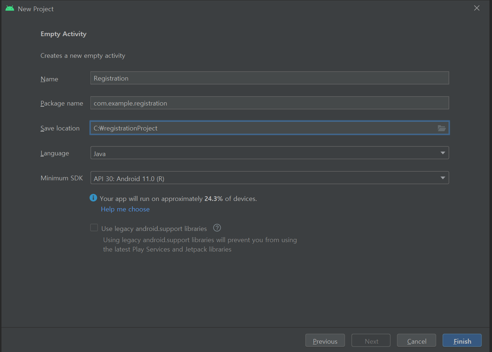

컴퓨터를 바꾸고 안드로이드 스튜디오를 새로 설치하고 프로젝트 생성을 하려고 하니

The path 'C:\ is not writable. 이라는 오류가 발생했다.

## 원인

프로젝트 생성시 프로젝트 명에 맞춰서 자동으로 폴더를 생성해 주는데 그 기능에 이상이 있는것 같다.

## 해결

일단 직접 수동으로 폴더를 만들어 준 후 Save location에 지정했다. 일일히 프로젝트를 만들때마다 폴더도 새로 만들어야 해서 불편하다. 전에는 잘 됬는데. 해결방법을 찾으면 추후에 포스팅 하겠다.

